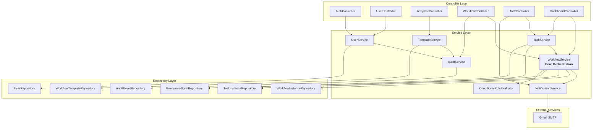

# Components

The backend follows a **layered architecture** with three primary layers: Controller (REST API), Service (Business Logic), and Repository (Data Access), plus cross-cutting concerns for security, logging, and async processing.

## Component Overview

**Controller Layer (8 components):**
1. AuthController - Authentication and session management
2. UserController - User management CRUD
3. TemplateController - Workflow template management
4. WorkflowController - Workflow instance operations
5. TaskController - Task completion and management
6. DashboardController - Aggregate statistics
7. AuditController - Audit trail access
8. ReportController - Report generation and export

**Service Layer (7 components):**
1. UserService - User management business logic
2. TemplateService - Template validation and management
3. WorkflowService - **Core orchestration** (instantiation, assignment, state management)
4. TaskService - Task completion, checklist validation, offboarding mirror
5. NotificationService - Email generation and SMTP delivery
6. AuditService - Comprehensive audit logging
7. ConditionalRuleEvaluator - Template conditional logic

**Repository Layer (11 components):**
- Spring Data JPA repositories for all entities (User, WorkflowTemplate, TemplateTask, TemplateCustomField, TemplateConditionalRule, WorkflowInstance, TaskInstance, TaskChecklistItem, ProvisionedItem, WorkflowStateHistory, AuditEvent)

**Cross-cutting (2 components):**
- GlobalExceptionHandler - Centralized error handling
- SecurityConfiguration - Spring Security setup

## Component Details

**WorkflowService (Core Orchestration)**

**Responsibility:** Workflow instantiation, state management, task assignment (the heart of the system)

**Key Methods:**
- `createWorkflowInstance(templateId, employeeDetails, customFieldValues, initiatedBy)` - Instantiate workflow from template
- `evaluateConditionalRules(template, customFieldValues)` - Evaluate task visibility
- `assignTasksForWorkflow(workflowInstanceId)` - Auto-assign ready tasks (load balancing algorithm)
- `updateWorkflowStatus(workflowInstanceId, newStatus, userId, notes)` - State transitions with validation
- `checkOffboardingMirror(employeeEmail)` - Find prior onboarding for offboarding
- `autoCompleteWorkflow(workflowInstanceId)` - Check completion and auto-transition

**Dependencies:** WorkflowInstanceRepository, TaskInstanceRepository, WorkflowStateHistoryRepository, ProvisionedItemRepository, TemplateService, NotificationService, AuditService

**Technology:** Spring @Service, @Transactional, Pessimistic locking for state updates

**PRD Coverage:** Epic 3 (Workflow Execution & Task Routing)

---

**TaskService (Task Completion & Offboarding Mirror)**

**Responsibility:** Task completion logic, checklist validation, offboarding mirror creation

**Key Methods:**
- `completeTask(taskInstanceId, checklistItems, userId)` - Complete task with validation
- `validateChecklist(checklistItems)` - Ensure all items checked
- `saveChecklistProgress(taskInstanceId, checklistItems)` - Partial save
- `createProvisionedItems(workflowInstanceId, taskInstanceId, checklistItems)` - Copy to provisioned_items
- `prePopulateOffboardingChecklist(offboardingTaskId, provisionedItems)` - Load from onboarding

**Dependencies:** TaskInstanceRepository, TaskChecklistItemRepository, ProvisionedItemRepository, WorkflowService, NotificationService, AuditService

**Technology:** Spring @Service, @Transactional

**PRD Coverage:** Epic 4 (Task Completion & Verification), Story 4.7 (Offboarding Mirror)

---

**NotificationService (Email Integration)**

**Responsibility:** Email generation, SMTP delivery, retry logic

**Key Methods:**
- `sendTaskAssignmentEmail(taskInstance, assignedUser)` - Task notification with deep link
- `sendTaskCompletionEmail(taskInstance, stakeholders)` - Completion notification
- `generateEmailHtml(template, data)` - Render HTML from Thymeleaf template
- `retryFailedEmail(emailId)` - Retry logic (max 3 retries, exponential backoff)

**Dependencies:** Spring Mail (JavaMail), Thymeleaf, AuditService

**Technology:** Spring @Service, @Async, Gmail SMTP (smtp.gmail.com:587), Thymeleaf templates

**Configuration:**
- SMTP: smtp.gmail.com:587 (TLS)
- Account: ctrlalteliteg@gmail.com
- Rate Limit: 500 emails/day (sufficient for MVP)

**PRD Coverage:** Stories 4.4 (Email Service), 4.5 (Email Triggers)

---

**TemplateService (Template Validation)**

**Responsibility:** Template management and validation

**Key Methods:**
- `createTemplate(request)` - Create with full validation
- `validateTemplate(template)` - Validate dependencies, conditionals, uniqueness
- `normalizeSequenceOrder(tasks)` - Auto-normalize to 1, 2, 3...
- `detectCircularDependencies(tasks)` - Detect and reject cycles

**Dependencies:** WorkflowTemplateRepository, TemplateTaskRepository, TemplateCustomFieldRepository, TemplateConditionalRuleRepository, AuditService

**PRD Coverage:** Epic 2 (Template Management), Story 2.3 (Validation)

---

**UserService (Authentication & Authorization)**

**Responsibility:** User management, authentication

**Key Methods:**
- `authenticateUser(username, password)` - Verify credentials
- `createUser(request)` - Create with BCrypt hashing
- `changePassword(id, currentPassword, newPassword)` - Password change
- `deactivateUser(id)` - Soft delete

**Dependencies:** UserRepository, PasswordEncoder (BCrypt), AuditService

**PRD Coverage:** Epic 1 (Foundation & Authentication)

---

**AuditService (Audit Logging)**

**Responsibility:** Comprehensive audit logging

**Key Methods:**
- `logUserAction(userId, actionType, entityType, entityId, description, metadata)`
- `logLogin(userId, ipAddress)`
- `getAuditEvents(filters, pagination)`
- `exportAuditLog(filters, format)`

**Dependencies:** AuditEventRepository

**Technology:** Spring @Service, @Async, Event listeners

**PRD Coverage:** Story 5.6 (Audit Capture), Story 5.5 (Audit Trail)

---

**ConditionalRuleEvaluator (Strategy Pattern)**

**Responsibility:** Evaluate conditional logic for templates

**Implementation:**
- EqualsOperator, NotEqualsOperator, ContainsOperator strategies
- Stateless utility service

**PRD Coverage:** Story 2.7 (Conditional Logic), Story 3.2 (Evaluation)

## Component Interaction Diagram

