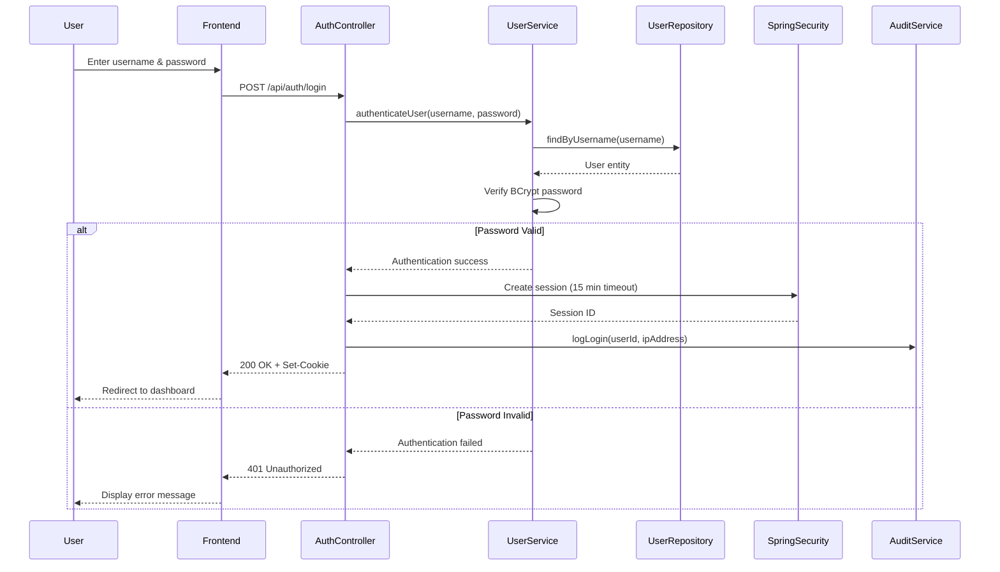
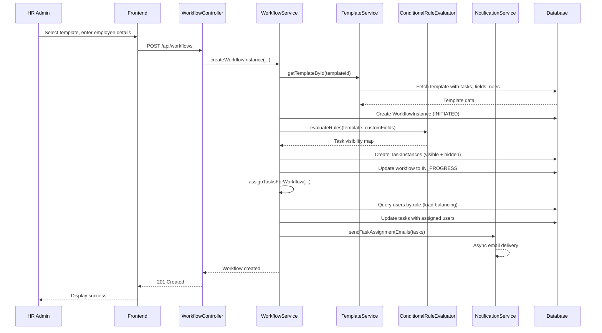
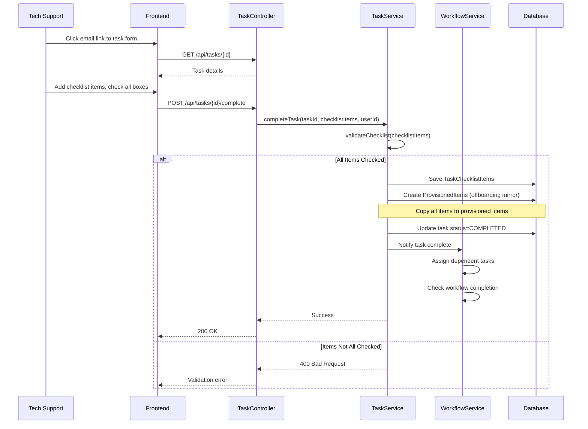
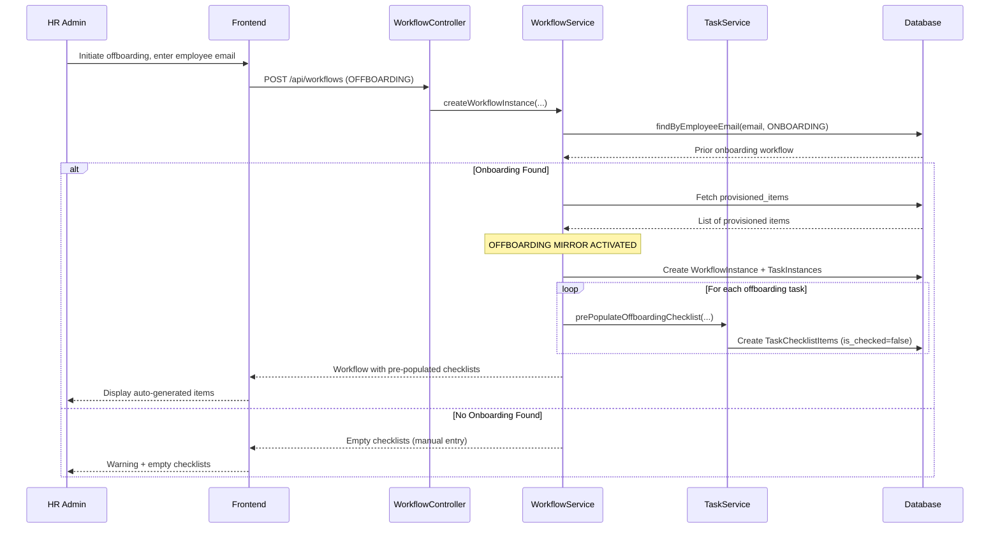
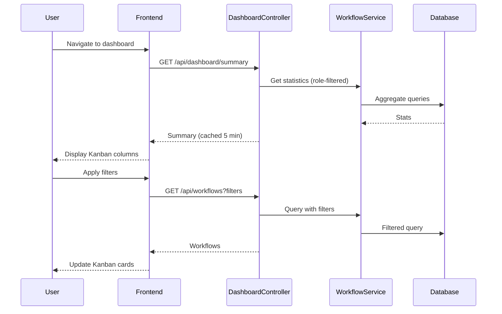

# Core Workflows

## Workflow 1: User Authentication & Login

**PRD Coverage:** Story 1.4 (Authentication & Session Management)

---

## Workflow 2: HR Initiates Onboarding Workflow

**Key Points:**
- Conditional rules evaluated once at instantiation
- Load balancing: assign to user with fewest IN_PROGRESS tasks
- Emails sent asynchronously (non-blocking)
- Status transitions: INITIATED → IN_PROGRESS automatically

**PRD Coverage:** Stories 3.2, 3.3, 3.5, 4.5

---

## Workflow 3: Task Completion with Checklist (Onboarding)

**Key Points:**
- Mandatory checklist verification (PRD Story 4.2)
- All checked items copied to provisioned_items
- Task completion triggers dependent task assignment
- Workflow auto-completes when all visible tasks done

**PRD Coverage:** Stories 4.2, 4.3, 4.6, 4.7

---

## Workflow 4: Offboarding Mirror (Critical Security Feature)

**Key Points:**
- **Offboarding mirror is THE key security feature**
- Searches for prior onboarding by employee_email
- Pre-populates checklists with provisioned items
- Category-based mapping (HARDWARE → hardware task, ACCESS → access task)
- Ensures 100% cleanup (no orphaned accounts)

**PRD Coverage:** Story 4.7 (Offboarding Mirror) - **Critical differentiator**

---

## Workflow 5: Dashboard with Kanban Visualization

**Key Points:**
- Kanban visualization (Initiated/In Progress/Blocked/Completed)
- Role-based filtering (HR sees all, others see only their workflows)
- Caching for performance (5-minute TTL)
- Real-time overdue task highlighting

**PRD Coverage:** Stories 5.1, 5.2, 5.3
