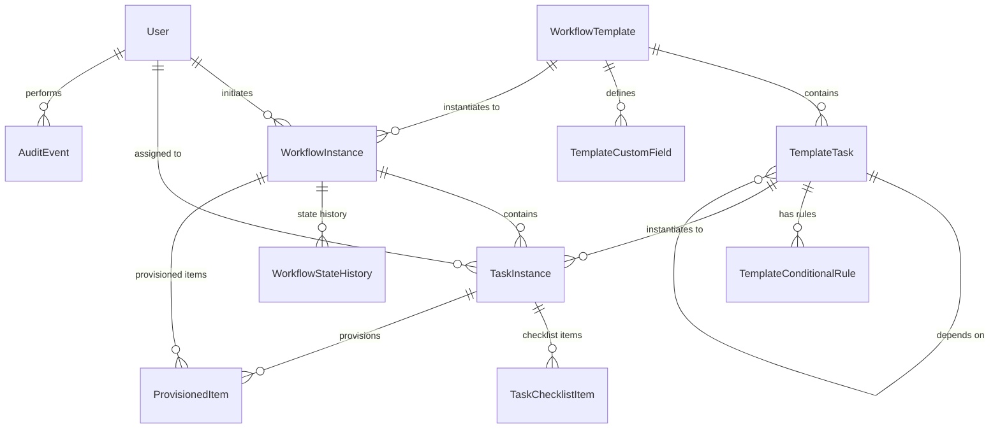

# Data Models

The system's data model comprises 10 core entities that map directly to the PRD's 37 user stories across 5 epics. Each entity is designed with audit capabilities, referential integrity, and support for the key "offboarding mirror" security feature.

## User

**Purpose:** System users with role-based access control (HR Admin, Line Manager, Tech Support, Administrator). Supports authentication, authorization, and audit trail attribution.

**Key Attributes:**
- `id`: UUID - Primary key
- `username`: String (unique, indexed) - Login credential
- `email`: String (unique, indexed) - Contact and notification address
- `passwordHash`: String - BCrypt-hashed password (never exposed in DTOs)
- `role`: Enum (HR_ADMIN, LINE_MANAGER, TECH_SUPPORT, ADMINISTRATOR) - RBAC role
- `isActive`: Boolean (default true) - Soft delete flag
- `createdAt`, `createdBy`, `updatedAt`, `updatedBy` - Audit columns

**Relationships:**
- One-to-Many: User → WorkflowInstance (as initiator)
- One-to-Many: User → TaskInstance (as assigned user)
- One-to-Many: User → AuditEvent (as actor)

## WorkflowTemplate

**Purpose:** Reusable workflow blueprints for onboarding/offboarding processes.

**Key Attributes:**
- `id`: UUID - Primary key
- `name`: String (unique per type) - Template identifier
- `description`: String (optional)
- `type`: Enum (ONBOARDING, OFFBOARDING)
- `isActive`: Boolean (default true)
- `createdAt`, `createdBy`, `updatedAt`, `updatedBy`

**Relationships:**
- One-to-Many: WorkflowTemplate → TemplateTask
- One-to-Many: WorkflowTemplate → TemplateCustomField
- One-to-Many: WorkflowTemplate → WorkflowInstance

## TemplateTask

**Purpose:** Individual tasks within workflow templates with role assignments, sequencing, and dependencies.

**Key Attributes:**
- `id`: UUID - Primary key
- `templateId`: UUID (FK to WorkflowTemplate)
- `taskName`: String
- `description`: String (optional)
- `assignedRole`: Enum (HR_ADMIN, LINE_MANAGER, TECH_SUPPORT, ADMINISTRATOR)
- `sequenceOrder`: Integer (indexed)
- `isParallel`: Boolean (default false)
- `dependencyTaskId`: UUID (FK to TemplateTask, nullable)
- `createdAt`, `updatedAt`

**Relationships:**
- Many-to-One: TemplateTask → WorkflowTemplate
- Self-referential: TemplateTask → TemplateTask (dependencies)
- One-to-Many: TemplateTask → TemplateConditionalRule

## TemplateCustomField

**Purpose:** Custom data fields captured during workflow initiation (e.g., start date, remote status).

**Key Attributes:**
- `id`: UUID - Primary key
- `templateId`: UUID (FK to WorkflowTemplate)
- `fieldName`: String (unique within template)
- `fieldNameSlug`: String (auto-generated for conditional rules)
- `fieldType`: Enum (TEXT, NUMBER, DATE, BOOLEAN, SELECT)
- `isRequired`: Boolean (default false)
- `options`: JSONB (for SELECT type)

**Relationships:**
- Many-to-One: TemplateCustomField → WorkflowTemplate

## TemplateConditionalRule

**Purpose:** Conditional logic for showing/hiding tasks based on custom field values.

**Key Attributes:**
- `id`: UUID - Primary key
- `taskId`: UUID (FK to TemplateTask)
- `conditionField`: String (references TemplateCustomField.fieldNameSlug)
- `conditionOperator`: Enum (EQUALS, NOT_EQUALS, CONTAINS)
- `conditionValue`: String
- `action`: Enum (SHOW_TASK, HIDE_TASK)

**Relationships:**
- Many-to-One: TemplateConditionalRule → TemplateTask

## WorkflowInstance

**Purpose:** Specific employee's onboarding/offboarding workflow instantiated from a template.

**Key Attributes:**
- `id`: UUID - Primary key
- `templateId`: UUID (FK to WorkflowTemplate)
- `employeeName`: String
- `employeeEmail`: String (indexed)
- `employeeRole`: String
- `workflowType`: Enum (ONBOARDING, OFFBOARDING)
- `status`: Enum (INITIATED, IN_PROGRESS, BLOCKED, COMPLETED) (indexed)
- `initiatedBy`: UUID (FK to User)
- `initiatedAt`: Timestamp (indexed)
- `completedAt`: Timestamp (nullable)
- `customFieldValues`: JSONB
- `createdAt`, `updatedAt`

**Relationships:**
- Many-to-One: WorkflowInstance → WorkflowTemplate
- Many-to-One: WorkflowInstance → User (as initiator)
- One-to-Many: WorkflowInstance → TaskInstance
- One-to-Many: WorkflowInstance → WorkflowStateHistory
- One-to-Many: WorkflowInstance → ProvisionedItem

## TaskInstance

**Purpose:** Individual task within a workflow instance with assignment, state, and checklist tracking.

**Key Attributes:**
- `id`: UUID - Primary key
- `workflowInstanceId`: UUID (FK to WorkflowInstance, indexed)
- `templateTaskId`: UUID (FK to TemplateTask)
- `taskName`: String
- `assignedUserId`: UUID (FK to User, nullable, indexed)
- `assignedRole`: Enum
- `status`: Enum (NOT_STARTED, IN_PROGRESS, BLOCKED, COMPLETED) (indexed)
- `isVisible`: Boolean (default true)
- `dueDate`: Timestamp (nullable, indexed)
- `completedAt`: Timestamp (nullable)
- `completedBy`: UUID (FK to User, nullable)
- `checklistData`: JSONB (for partial saves)
- `createdAt`, `updatedAt`

**Relationships:**
- Many-to-One: TaskInstance → WorkflowInstance
- Many-to-One: TaskInstance → TemplateTask
- Many-to-One: TaskInstance → User (as assigned user)
- One-to-Many: TaskInstance → TaskChecklistItem

## TaskChecklistItem

**Purpose:** Individual checklist items verified during task completion.

**Key Attributes:**
- `id`: UUID - Primary key
- `taskInstanceId`: UUID (FK to TaskInstance, indexed)
- `itemDescription`: String
- `category`: Enum (HARDWARE, SOFTWARE, ACCESS, OTHER)
- `itemIdentifier`: String (optional)
- `isChecked`: Boolean (default false)
- `checkedAt`: Timestamp (nullable)
- `checkedBy`: UUID (FK to User, nullable)
- `createdAt`, `updatedAt`

**Relationships:**
- Many-to-One: TaskChecklistItem → TaskInstance

## ProvisionedItem

**Purpose:** **Critical security feature** - Records all items provisioned during onboarding for use in offboarding mirror.

**Key Attributes:**
- `id`: UUID - Primary key
- `workflowInstanceId`: UUID (FK to WorkflowInstance, indexed)
- `taskInstanceId`: UUID (FK to TaskInstance, indexed)
- `itemDescription`: String
- `category`: Enum (HARDWARE, SOFTWARE, ACCESS, OTHER)
- `itemIdentifier`: String (optional)
- `provisionedAt`: Timestamp
- `provisionedBy`: UUID (FK to User)

**Relationships:**
- Many-to-One: ProvisionedItem → WorkflowInstance
- Many-to-One: ProvisionedItem → TaskInstance

## WorkflowStateHistory

**Purpose:** Audit trail for workflow state transitions.

**Key Attributes:**
- `id`: UUID - Primary key
- `workflowInstanceId`: UUID (FK to WorkflowInstance, indexed)
- `previousStatus`: Enum (WorkflowStatus)
- `newStatus`: Enum (WorkflowStatus)
- `changedBy`: UUID (FK to User)
- `changedAt`: Timestamp (indexed)
- `notes`: String (optional)

**Relationships:**
- Many-to-One: WorkflowStateHistory → WorkflowInstance

## AuditEvent

**Purpose:** Comprehensive audit log for all system actions.

**Key Attributes:**
- `id`: UUID - Primary key
- `userId`: UUID (FK to User, indexed)
- `actionType`: Enum (USER_LOGIN, USER_LOGOUT, WORKFLOW_INITIATED, etc.) (indexed)
- `entityType`: Enum (WORKFLOW, TASK, TEMPLATE, USER) (indexed)
- `entityId`: UUID (indexed)
- `description`: String
- `metadata`: JSONB
- `ipAddress`: String (optional)
- `timestamp`: Timestamp (indexed)

**Relationships:**
- Many-to-One: AuditEvent → User

## Data Model ER Diagram

