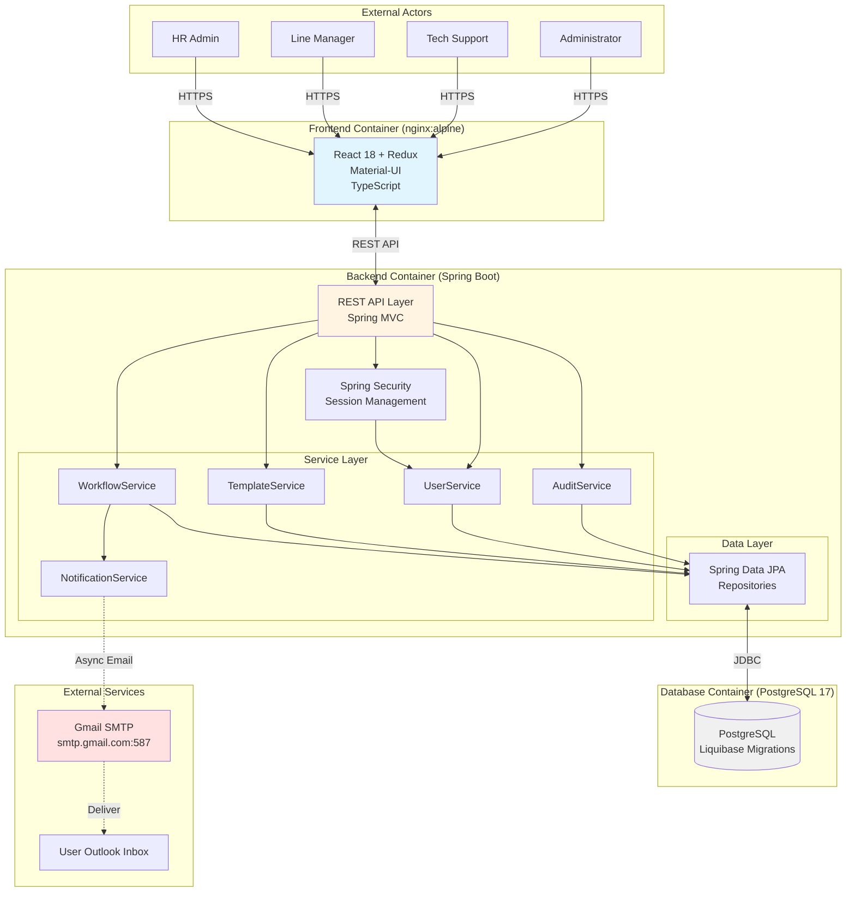

# High Level Architecture

## Technical Summary

The Employee Lifecycle Management System is built as a **modular monolithic application** using a modern full-stack architecture. The backend implements a **RESTful API** using Spring Boot 3.x with clear service boundaries (WorkflowService, NotificationService, TemplateService, UserService, AuditService), while the frontend provides a responsive React-based user interface. The system leverages **PostgreSQL 17** for transactional data persistence with Liquibase-managed schema migrations, **session-based authentication** with Spring Security for user management, and **Gmail SMTP integration** for email notifications. The architecture supports the PRD's core goals of workflow orchestration, mandatory verification, and the critical "offboarding mirror" security feature that automatically tracks provisioned items during onboarding for deprovisioning during offboarding. Deployment uses **Docker Compose** for local development with three containerized services (frontend nginx, backend Spring Boot, PostgreSQL database).

## High Level Overview

**1. Architectural Style: Modular Monolith**

The system follows a **modular monolithic architecture** with clear service boundaries, as specified in the PRD's Technical Assumptions. This approach balances simplicity with maintainability:

- Single deployable Spring Boot application with logically separated services
- Five core service modules: WorkflowService, NotificationService, TemplateService, UserService, AuditService
- Shared PostgreSQL database with potential for schema-level logical separation
- Services communicate via direct method calls (in-process) with well-defined interfaces
- Can evolve to microservices post-MVP if scaling demands require it

**Rationale:** With <50 employee transitions per month initially, a monolith handles the load easily while avoiding microservices operational complexity (service discovery, distributed tracing, inter-service communication). The 12-16 week MVP timeline benefits from simplified development and deployment.

**2. Repository Structure: Monorepo**

```
hackathon-workflow-2025/
├── frontend/          # React + TypeScript application
├── backend/           # Spring Boot + Java application
├── docker-compose.yml # Orchestration for all services
└── README.md          # Setup and development instructions
```

Single Git repository containing both frontend and backend enables:
- Atomic commits across API contracts (frontend/backend changes together)
- Simplified dependency management and version coordination
- Single CI/CD pipeline (when needed post-MVP)
- Easier developer onboarding (clone once, run everything)

**3. Service Architecture**

The backend is organized into five core service modules with clear responsibilities:

- **WorkflowService:** Manages workflow templates, instances, state transitions, task assignment, and dependency resolution
- **NotificationService:** Handles email generation, SMTP delivery, retry logic, and notification logging
- **TemplateService:** CRUD operations for workflow templates, custom fields, conditional rules, and template validation
- **UserService:** Authentication, authorization (RBAC), user management, session handling
- **AuditService:** Comprehensive logging of all system actions for compliance and troubleshooting

**4. Primary User Interaction Flow**

```
User Login → Dashboard (Kanban View) → HR Initiates Workflow → Tasks Auto-Assigned →
Email Notification Sent → User Clicks Email Link → Task Completion Form →
Checklist Verification → Task Marked Complete → Dependent Tasks Triggered →
Workflow Progress Updated → Dashboard Reflects Changes
```

**5. Data Flow (Conceptual)**

```
Frontend (React) ←→ REST API (Spring Boot) ←→ PostgreSQL Database
                          ↓
                    Gmail SMTP Server (Notifications)
```

- Frontend communicates exclusively via REST API (no direct database access)
- Backend enforces all business logic, validation, and security rules
- Database stores all persistent state (workflows, tasks, users, audit logs)
- Email notifications sent asynchronously (non-blocking)

**6. Key Architectural Decisions**

| Decision | Choice | Rationale |
|----------|--------|-----------|
| **Deployment Model** | Docker Compose (local only) | PRD specifies no CI/CD for MVP; simplifies development |
| **Authentication** | Session-based (not JWT) | Simpler for MVP; easier session revocation; 15-min timeout specified in PRD |
| **Database** | Single shared PostgreSQL | Modular monolith doesn't require separate databases; transactional integrity easier |
| **Email Delivery** | Asynchronous (@Async) | Non-blocking; retry logic for failures; doesn't impact API response times |
| **API Style** | REST (not GraphQL) | Team familiarity; simpler for CRUD operations; PRD implies REST |
| **State Management** | Database-driven workflow state machine | Reliable state transitions; audit trail; supports recovery from failures |

## High Level Project Diagram



## Architectural and Design Patterns

**1. Layered Architecture Pattern**

**Recommendation: Traditional 3-tier Layered Architecture**

**Rationale:** Aligns with Spring Boot conventions, clear separation (Controller → Service → Repository), simplifies AI agent code generation, PRD doesn't require hexagonal architecture flexibility.

**Implementation:**
- Controllers handle HTTP concerns (validation, serialization, error responses)
- Services contain all business logic (workflow state machines, assignment algorithms, validation)
- Repositories abstract database access (Spring Data JPA interfaces)
- DTOs at API boundaries (never expose entities directly)

---

**2. Repository Pattern**

**Recommendation: Spring Data JPA Repositories**

**Rationale:** PRD specifies "Spring Data JPA with Hibernate ORM; use DTOs at controller boundaries", provides abstraction over database access, enables testing with mocks, reduces boilerplate.

---

**3. Dependency Injection Pattern**

**Recommendation: Constructor Injection (Spring's default)**

**Rationale:** Immutable dependencies (final fields), easier unit testing, compiler-enforced dependency provision, Spring Boot 3.x best practice.

---

**4. Data Transfer Object (DTO) Pattern**

**Recommendation: Separate DTOs for API layer**

**Rationale:** PRD explicitly specifies DTOs at controller boundaries, decouples API from database schema, prevents exposing sensitive fields, allows API evolution without database changes.

---

**5. Service Layer Pattern**

**Recommendation: Transactional Services with Business Logic**

**Rationale:** Encapsulates complex business rules (workflow state machine, conditional logic, task assignment), provides transaction boundaries (@Transactional), reusable across controllers, testable in isolation.

---

**6. Asynchronous Processing Pattern**

**Recommendation: Spring @Async for email notifications**

**Rationale:** PRD specifies async email sending, task completion API returns immediately, retry logic doesn't block workflows, improves API performance.

---

**7. State Machine Pattern (for Workflow Orchestration)**

**Recommendation: Database-driven state machine with validation**

**Rationale:** PRD defines workflow states (INITIATED → IN_PROGRESS → BLOCKED → COMPLETED), state transitions have business rules, database persistence ensures state survives restarts, audit trail logs all changes.

---

**8. Strategy Pattern (for Conditional Logic Evaluation)**

**Recommendation: Rule engine for template conditional logic**

**Rationale:** PRD Story 2.7 requires conditional task logic (operators: EQUALS, NOT_EQUALS, CONTAINS), flexible and extensible for new operators.

---

**9. Facade Pattern (for Complex Workflows)**

**Recommendation: WorkflowOrchestrationFacade**

**Rationale:** Workflow initiation involves multiple steps (create workflow → instantiate tasks → evaluate conditionals → assign tasks → send emails), facade simplifies controller logic, provides transactional boundary.
