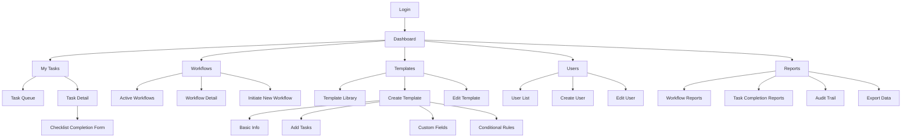
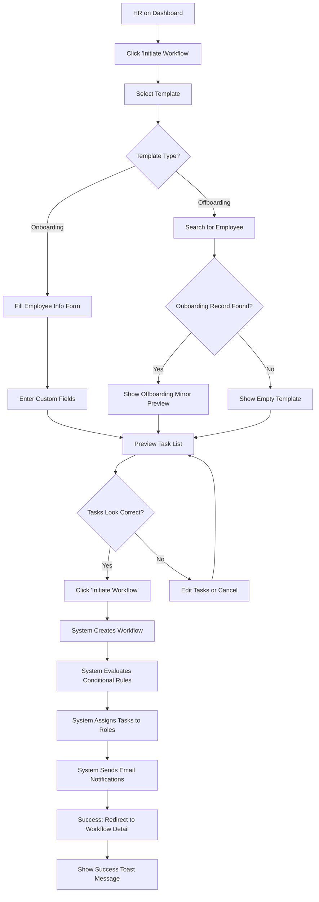
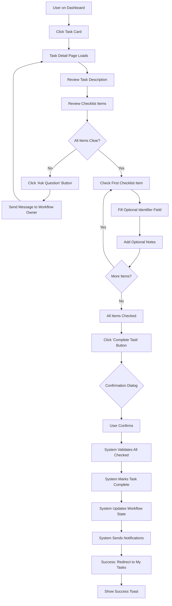
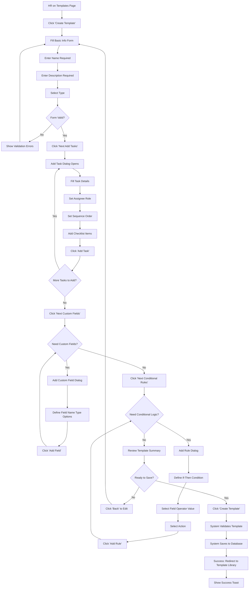
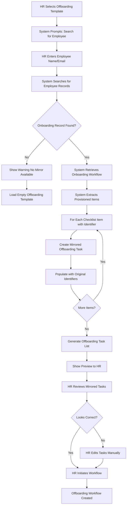
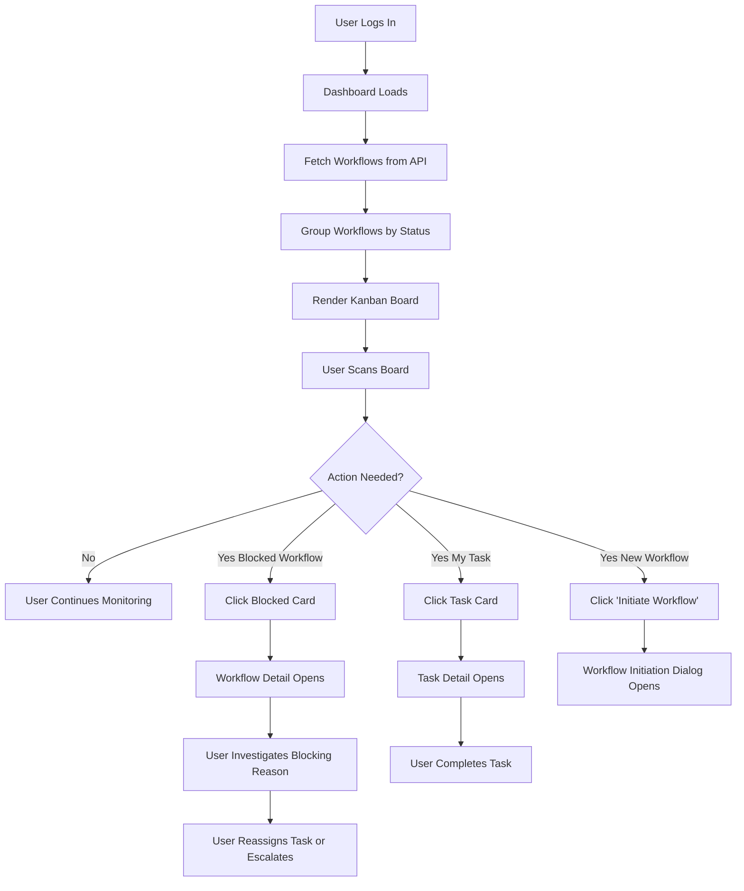

# Employee Lifecycle Management System - Front-End UX Specification

**Document Version:** 1.0
**Date:** 2025-10-30
**Author:** UX Expert - Sally
**Status:** Complete and Approved

**Project:** Employee Lifecycle Management System (Magna BC)
**Repository:** `Hackathon-Workflow-2025/`

---

## Table of Contents

1. [Introduction: UX Goals & Principles](#1-introduction-ux-goals--principles)
2. [Information Architecture](#2-information-architecture)
3. [User Flows](#3-user-flows)
4. [Wireframes & Mockups](#4-wireframes--mockups)
5. [Component Library](#5-component-library)
6. [Branding & Style Guide](#6-branding--style-guide)
7. [Accessibility Requirements](#7-accessibility-requirements)
8. [Responsiveness Strategy](#8-responsiveness-strategy)
9. [Animation & Micro-interactions](#9-animation--micro-interactions)
10. [Performance Considerations](#10-performance-considerations)
11. [Next Steps](#11-next-steps)

---

## 1. Introduction: UX Goals & Principles

### Purpose

This document defines the user experience specifications for the Employee Lifecycle Management System, a web application designed to automate and track employee onboarding and offboarding workflows. The system serves as a "mission control center" for HR administrators, line managers, and task executors to manage complex multi-step processes efficiently.

### Target User Personas

#### 1. HR Administrator (Power User)

**Role:** Creates templates, initiates workflows, manages system configuration

**Characteristics:**
- Age: 30-50 years old
- Tech proficiency: Medium to high
- Daily usage: 3-5 hours per day
- Primary device: Desktop (80%), Tablet (20%)

**Needs:**
- Efficiency in bulk operations (initiating multiple workflows)
- Clear visibility into all workflows across the organization
- Template customization without technical knowledge
- Audit trail for compliance reporting

**Pain Points:**
- Manual paper-based processes prone to errors
- No visibility into workflow status (constant email follow-ups)
- Difficulty tracking who completed what tasks

**Success Metric:** Can create and initiate workflows in under 2 minutes

---

#### 2. Line Manager (Task Executor)

**Role:** Approves onboarding requests, completes assigned tasks

**Characteristics:**
- Age: 35-55 years old
- Tech proficiency: Low to medium
- Daily usage: 15-30 minutes per day (checking tasks)
- Primary device: Tablet (50%), Desktop (30%), Mobile (20%)

**Needs:**
- Clear task lists (what needs to be done today)
- Quick completion workflows (minimal clicks)
- Mobile/tablet access (often away from desk)
- Context about the employee (why this task matters)

**Pain Points:**
- Overwhelmed by email notifications
- Unclear what tasks are urgent
- Difficulty accessing systems on mobile devices

**Success Metric:** Can complete assigned tasks without clarification requests

---

#### 3. Tech Support / Administrator (Specialist)

**Role:** Provisions accounts, installs software, configures hardware

**Characteristics:**
- Age: 25-40 years old
- Tech proficiency: High
- Daily usage: 2-4 hours per day
- Primary device: Desktop (90%), Mobile (10%)

**Needs:**
- Detailed checklists (specific steps to provision accounts)
- Verification workflows (confirm each item completed)
- Historical context (what was provisioned during onboarding)
- Integration with IT systems (Active Directory, email, etc.)

**Pain Points:**
- Orphaned accounts after employees leave (security risk)
- Manual tracking of provisioned items in spreadsheets
- No automated offboarding mirror of onboarding tasks

**Success Metric:** Zero orphaned accounts after offboarding

---

#### 4. System Administrator (Oversight)

**Role:** Manages users, monitors system health, handles escalations

**Characteristics:**
- Age: 30-50 years old
- Tech proficiency: High
- Daily usage: 1-2 hours per day (monitoring)
- Primary device: Desktop (95%), Mobile (5%)

**Needs:**
- System-wide visibility (all workflows, all users)
- Bottleneck identification (which tasks are blocked)
- User management (create/edit users, assign roles)
- Audit trail and reporting

**Pain Points:**
- No visibility into system health
- Manual intervention required for blocked workflows
- Difficulty generating compliance reports

**Success Metric:** Can identify bottlenecks within 30 seconds

---

### Usability Goals

1. **Ease of Learning:** New users can complete their first task within 5 minutes of login (no training required for basic tasks)

2. **Efficiency of Use:** Experienced users can complete common tasks (initiate workflow, complete task) in under 2 minutes

3. **Error Prevention:** System prevents common mistakes (required fields, validation, confirmation dialogs for destructive actions)

4. **Error Recovery:** Clear error messages with actionable next steps (not "Error 500" but "Failed to save workflow. Please check your internet connection and try again.")

5. **User Satisfaction:** System Usability Scale (SUS) score ≥80 (Grade A) measured via post-launch surveys

6. **Accessibility:** WCAG 2.1 Level AA compliance for all screens (keyboard navigation, screen reader support, color contrast)

---

### Design Principles

#### 1. Clarity over Cleverness

**Philosophy:** Use familiar UI patterns and terminology. Avoid novel interactions that require learning.

**Examples:**
- Use standard Kanban board for dashboard (not custom visualization)
- Use checkboxes for task verification (not custom toggle switches)
- Use breadcrumbs for navigation (not hidden hamburger menus on desktop)

**Anti-Pattern:** Custom drag-and-drop interface for template builder ❌
**Better Approach:** Form-based wizard with clear step-by-step progression ✅

---

#### 2. Progressive Disclosure

**Philosophy:** Show executive summaries on overview screens, detailed information only when the user drills down.

**Examples:**
- Dashboard shows workflow cards with high-level info (employee name, type, progress bar)
- Clicking card reveals full workflow detail with timeline and all tasks
- Task cards show title and assignee, clicking reveals full checklist

**Anti-Pattern:** Dashboard shows all task details for every workflow (information overload) ❌
**Better Approach:** Dashboard shows summarized cards, detail page shows full information ✅

---

#### 3. Mandatory Verification

**Philosophy:** For security-critical operations (account provisioning, data access), require explicit verification (no "mark all complete" shortcuts).

**Examples:**
- Tech support must check each provisioned item individually (Active Directory account ✓, Email account ✓, VPN access ✓)
- "Complete Task" button disabled until all checklist items checked
- Offboarding tasks require confirmation dialog ("Are you sure you want to revoke all access for John Smith?")

**Anti-Pattern:** Single "Complete All Tasks" button ❌
**Better Approach:** Individual checkbox for each item, button enabled only when all checked ✅

---

#### 4. Immediate Feedback

**Philosophy:** Every user action triggers immediate visual feedback (loading states, success messages, error messages).

**Examples:**
- Button shows spinner during API call ("Saving...")
- Success toast appears immediately after task completion ("Task completed successfully")
- Error message appears inline below form field (not generic alert at top of page)

**Anti-Pattern:** User clicks button, nothing happens for 3 seconds, then redirects ❌
**Better Approach:** Button shows loading state immediately, success message confirms action ✅

---

#### 5. Audit Trail Transparency

**Philosophy:** All critical actions show "who did what when" for compliance and troubleshooting.

**Examples:**
- Task card shows "Completed by John Smith on 2025-10-25 at 3:42 PM"
- Workflow history timeline shows all state changes with timestamps and actors
- Template edit history shows all modifications with author and date

**Anti-Pattern:** System shows only current state (no history) ❌
**Better Approach:** Every card/detail view shows audit trail ✅

---

## 2. Information Architecture

### Site Map



---

### Navigation Structure

#### Primary Navigation (Persistent Sidebar)

**Desktop (≥960px):** Always visible, 240px width

**Tablet (600-959px):** Collapsed by default (60px icon-only), expands to 240px overlay on tap

**Mobile (0-599px):** Hidden by default, hamburger menu opens full-screen drawer

**Navigation Items:**

| Icon | Label | Route | Visible To | Badge |
|------|-------|-------|------------|-------|
| 🏠 | Dashboard | `/` | All users | None |
| ✓ | My Tasks | `/tasks` | All users | Count of pending tasks (red badge) |
| 🔄 | Workflows | `/workflows` | All users | None |
| 📋 | Templates | `/templates` | HR Admin, System Admin | None |
| 👥 | Users | `/users` | System Admin only | None |
| 📊 | Reports | `/reports` | HR Admin, System Admin | None |

**Active State:** Selected nav item highlighted with primary blue background and white text

**Hover State (Desktop):** Light gray background on hover

**Logo:** Magna BC logo at top of sidebar (full logo on expanded, icon only on collapsed)

**User Menu:** User avatar at bottom of sidebar (name + role on expanded, avatar only on collapsed)

---

#### Secondary Navigation (Tabs)

**Used for:** Sub-sections within a main section (e.g., Workflows → Active / Completed / All)

**Placement:** Below page header, above main content

**Example (Workflows Page):**
- Tab 1: Active (default)
- Tab 2: Completed
- Tab 3: All
- Tab 4: Blocked

**Active Tab:** Underlined with primary blue, bold text

**Inactive Tab:** Gray text, no underline, hover shows underline animation

---

#### Header Navigation

**Placement:** Top of screen, 64px height, spans full width

**Elements (Left to Right):**
1. **Global Search** (Ctrl/Cmd+K): Search workflows, tasks, templates, users
2. **Notification Bell**: Badge shows unread count, dropdown shows recent notifications
3. **User Avatar + Name**: Dropdown menu for profile, settings, logout

**Responsive Behavior:**
- Desktop: All elements visible
- Tablet: Hide user name (show avatar only)
- Mobile: Hide global search (accessible via hamburger menu)

---

#### Breadcrumbs

**Placement:** Below header, above page title

**Format:** Home / Section / Subsection / Current Page

**Example:**
```
Dashboard / Workflows / Workflow #1234 / Task: Setup Email Account
```

**Behavior:**
- Each segment clickable (navigate to parent)
- Current page not clickable, bold text
- Long segments truncate with ellipsis (max 30 characters)

**Responsive Behavior:**
- Desktop: Full breadcrumb trail
- Tablet: Show last 2 segments only
- Mobile: Show "< Back" button only (navigates to parent)

---

### Screen Organization by Role

#### HR Administrator Screens

**Full Access:**
- Dashboard (view all workflows)
- My Tasks (tasks assigned to HR)
- Workflows (create, view, edit all workflows)
- Templates (create, view, edit all templates)
- Reports (generate reports, export data)

**Primary Workflow:**
1. Dashboard → View workflow status
2. Templates → Create new template or edit existing
3. Workflows → Initiate new workflow from template
4. Dashboard → Monitor workflow progress

---

#### Line Manager Screens

**Limited Access:**
- Dashboard (view workflows for their department)
- My Tasks (tasks assigned to them)
- Workflows (view workflows they're involved in, cannot create/edit)

**Primary Workflow:**
1. My Tasks → View pending tasks
2. Task Detail → Review task requirements
3. Checklist Completion Form → Complete task
4. Dashboard → View updated workflow status

---

#### Tech Support / Administrator Screens

**Limited Access:**
- Dashboard (view workflows with tech tasks)
- My Tasks (provisioning tasks assigned to them)
- Workflows (view workflows they're involved in)

**Primary Workflow:**
1. My Tasks → View provisioning tasks
2. Task Detail → Review employee details and requirements
3. Checklist Completion Form → Verify each provisioned item
4. Dashboard → Confirm task completion reflected

---

#### System Administrator Screens

**Full Access:**
- All screens
- Users (create, view, edit, deactivate users)
- System settings (audit logs, system health)

**Primary Workflow:**
1. Dashboard → Monitor system health
2. Users → Manage user accounts
3. Reports → Generate audit trail for compliance

---

### Key Navigation Decisions

**1. Dashboard-First Design:**
- Dashboard is the default landing page after login
- All roles see a customized dashboard based on their permissions
- Maximum 3 clicks to reach any screen from dashboard

**2. Persistent Sidebar:**
- Navigation always visible on desktop (no hamburger menu)
- Reduces cognitive load (no need to remember menu structure)
- Faster navigation for power users

**3. Role-Based Visibility:**
- Hide screens user doesn't have access to (not grayed out, completely hidden)
- Reduces confusion, cleaner UI
- Backend enforces permissions (frontend hiding is UX, not security)

**4. Search-First for Power Users:**
- Global search (Ctrl/Cmd+K) accessible from any screen
- Quickly jump to specific workflow, task, or template by ID or name
- Recent searches saved for quick access

**5. Breadcrumbs for Context:**
- Always show where user is in the hierarchy
- Easy to navigate back to parent screens
- Reduces "where am I?" confusion

---

## 3. User Flows

### Flow 1: HR Initiates Onboarding Workflow

**User Goal:** Create a new onboarding workflow for a new employee from a template

**Entry Points:**
- Dashboard → "Initiate Workflow" button
- Workflows page → "Initiate New Workflow" button
- Global command (Ctrl/Cmd+I)

**Preconditions:**
- User is logged in as HR Admin
- At least one onboarding template exists

**Success Criteria:**
- Workflow created successfully
- Tasks assigned to appropriate roles
- Email notifications sent to assignees
- Workflow appears on dashboard

---

**Flow Diagram:**



---

**Step-by-Step Breakdown:**

1. **HR clicks "Initiate Workflow" button**
   - Opens full-screen dialog (modal)
   - Dialog title: "Initiate New Workflow"
   - Step 1 of 3 indicator at top

2. **Select Template (Step 1)**
   - List of available templates (cards with name, description, task count)
   - Filter by type: Onboarding / Offboarding / Custom
   - Search bar to filter templates by name
   - HR clicks template card to select
   - "Next" button enabled after selection

3. **Fill Employee Information (Step 2)**
   - Form fields:
     - Employee Name (required, text input)
     - Employee Email (required, email input with validation)
     - Department (required, dropdown)
     - Job Title (required, text input)
     - Start Date (required, date picker, default: today)
     - Manager (required, user search dropdown)
   - Custom fields from template appear below standard fields
   - "Back" button to return to template selection
   - "Next" button enabled after all required fields filled

4. **Preview Task List (Step 3)**
   - Shows all tasks from template with assignees
   - Tasks ordered by sequence
   - Shows conditional logic applied (e.g., "If remote employee → Skip office tour task")
   - Edit button next to each task (optional: modify assignee or due date)
   - "Back" button to return to form
   - "Initiate Workflow" button to submit

5. **System Processing (Backend)**
   - Creates workflow record in database
   - Evaluates conditional rules (hide/show tasks based on custom field values)
   - Assigns tasks to users/roles
   - Generates email notifications
   - Returns workflow ID

6. **Success Confirmation**
   - Dialog closes
   - User redirected to Workflow Detail page
   - Success toast appears: "Workflow initiated successfully for [Employee Name]"
   - Workflow card appears on dashboard

---

**Edge Cases:**

- **Template has no tasks:** Show warning "This template has no tasks. Please edit the template before initiating a workflow."
- **No templates exist:** Show empty state with "Create Template" button
- **Network error during submission:** Show error toast "Failed to initiate workflow. Please try again." Keep dialog open with form data preserved.
- **Duplicate employee name:** Show warning "An active workflow already exists for this employee. Are you sure you want to create another?"

---

### Flow 2: Task Executor Completes Task with Verification

**User Goal:** Complete an assigned task by verifying all checklist items

**Entry Points:**
- Dashboard → Click task card
- My Tasks page → Click task row
- Email notification → Click "View Task" link

**Preconditions:**
- User is logged in
- User is assigned to the task
- Task status is "PENDING" or "IN_PROGRESS"

**Success Criteria:**
- All checklist items verified
- Task marked as "COMPLETED"
- Workflow progresses to next task
- Notification sent to workflow initiator

---

**Flow Diagram:**



---

**Step-by-Step Breakdown:**

1. **User clicks task card on dashboard**
   - Navigates to Task Detail page
   - URL: `/tasks/[taskId]`
   - Page loads with task details

2. **Task Detail Page displays:**
   - **Header Section:**
     - Task title (large, bold)
     - Workflow context: "Part of: Onboarding - John Smith"
     - Status badge (PENDING, IN_PROGRESS, COMPLETED, BLOCKED)
     - Due date (if set)
     - Assigned to: User name and avatar
   - **Description Section:**
     - Task description (markdown formatted)
     - Employee details (name, email, department, start date)
     - Custom fields from workflow (e.g., "Is Remote: Yes")
   - **Checklist Section:**
     - Header: "Verification Checklist (0 of 5 completed)"
     - List of checklist items (see detailed design below)
   - **Actions Section:**
     - "Complete Task" button (disabled until all items checked)
     - "Ask Question" button (opens message dialog)
     - "Mark as Blocked" button (escalate if task can't be completed)

3. **User checks first checklist item:**
   - Click checkbox (24×24px)
   - Checkbox animates from unchecked → checked (150ms)
   - Item description gets strikethrough and reduces opacity to 0.6
   - Checklist header updates: "Verification Checklist (1 of 5 completed)"
   - Optional: User fills identifier field (e.g., "Email Address: john.smith@magna-bc.com")
   - Optional: User adds notes (e.g., "Provisioned on 2025-10-25")

4. **User checks all remaining items:**
   - Repeat step 3 for each item
   - Checklist header updates: "Verification Checklist (5 of 5 completed)"
   - "Complete Task" button becomes enabled (primary blue color)
   - Subtle green checkmark icon appears next to header

5. **User clicks "Complete Task" button:**
   - Confirmation dialog appears:
     - Title: "Complete Task?"
     - Body: "Are you sure you want to mark this task as completed? This action cannot be undone."
     - Actions: "Cancel" (gray button), "Complete Task" (green button)

6. **User confirms:**
   - Dialog closes
   - Button shows loading spinner ("Completing...")
   - API call to backend: `POST /api/tasks/{taskId}/complete`
   - Backend validates all checklist items checked
   - Backend marks task as COMPLETED
   - Backend updates workflow state (progresses to next task if applicable)
   - Backend sends email notifications to workflow owner and next task assignee

7. **Success:**
   - User redirected to My Tasks page
   - Success toast appears: "Task completed successfully! ✓"
   - Optional: Confetti animation (brief, respectful of accessibility)
   - Task removed from "My Tasks" list
   - Dashboard updates to show workflow progress

---

**Edge Cases:**

- **User tries to complete task without checking all items:** Button remains disabled, no action occurs
- **Network error during submission:** Show error toast "Failed to complete task. Please check your connection and try again." Keep user on page, preserve checklist state.
- **Task already completed by another user:** Show error dialog "This task was already completed by [User Name] at [Timestamp]. Redirecting to dashboard..."
- **User marks task as blocked:** Opens dialog to enter blocking reason, sends notification to workflow owner and system admin

---

### Flow 3: HR Creates Workflow Template

**User Goal:** Create a reusable workflow template for onboarding or offboarding

**Entry Points:**
- Templates page → "Create Template" button
- Dashboard → "Create Template" quick action (if no templates exist)

**Preconditions:**
- User is logged in as HR Admin or System Admin
- User has permission to create templates

**Success Criteria:**
- Template created with name, description, type
- Tasks added with title, description, assignee role, sequence
- Custom fields defined (optional)
- Conditional rules configured (optional)
- Template appears in Template Library

---

**Flow Diagram:**



---

**Step-by-Step Breakdown:**

1. **HR clicks "Create Template" button**
   - Navigates to Template Builder page
   - URL: `/templates/new`
   - Shows Step 1 of 4: Basic Information

2. **Step 1: Basic Information**
   - Form fields:
     - **Template Name** (required, text input, max 100 chars)
       - Example: "Software Engineer Onboarding"
     - **Description** (required, textarea, max 500 chars)
       - Example: "Standard onboarding process for new software engineers including account provisioning, equipment setup, and training"
     - **Template Type** (required, radio buttons)
       - Options: Onboarding / Offboarding / Custom
     - **Estimated Duration** (optional, number input, in days)
       - Example: "14 days"
   - "Next: Add Tasks" button enabled after required fields filled

3. **Step 2: Add Tasks**
   - Shows list of added tasks (empty initially)
   - "Add Task" button opens dialog:
     - **Task Title** (required, text input)
       - Example: "Setup Email Account"
     - **Task Description** (required, textarea, markdown supported)
       - Example: "Create email account in Office 365 and assign appropriate licenses"
     - **Assigned to Role** (required, dropdown)
       - Options: HR Admin, Line Manager, Tech Support, System Admin, Custom Role
     - **Sequence Order** (auto-incremented, editable)
       - Example: Task 1, Task 2, Task 3...
     - **Due Date Offset** (optional, number input)
       - Example: "Complete within 2 days of workflow start"
     - **Checklist Items** (optional, repeatable)
       - Add multiple verification items
       - Example: "Create email account", "Assign Office 365 license", "Add to distribution lists"
     - "Add Task" button saves and closes dialog
   - Tasks appear in list (draggable to reorder)
   - Edit/Delete buttons for each task
   - "Next: Custom Fields" button enabled after at least one task added

4. **Step 3: Custom Fields (Optional)**
   - Shows list of custom fields (empty initially)
   - "Add Custom Field" button opens dialog:
     - **Field Name** (required, text input)
       - Example: "Is Remote?"
     - **Field Type** (required, dropdown)
       - Options: Text, Number, Date, Dropdown, Checkbox, Email
     - **Field Options** (if type = Dropdown)
       - Add multiple options
       - Example: "Yes", "No"
     - **Required** (checkbox)
     - "Add Field" button saves and closes dialog
   - Fields appear in list
   - Edit/Delete buttons for each field
   - "Next: Conditional Rules" button (always enabled, can skip)

5. **Step 4: Conditional Rules (Optional)**
   - Shows list of rules (empty initially)
   - "Add Rule" button opens dialog:
     - **Rule Name** (required, text input)
       - Example: "Skip office tour if remote"
     - **Condition** (IF section)
       - **Field** (dropdown of custom fields)
       - **Operator** (equals, not equals, contains, greater than, less than)
       - **Value** (text input or dropdown based on field type)
       - Example: "If 'Is Remote?' equals 'Yes'"
     - **Action** (THEN section)
       - **Action Type** (dropdown)
         - Options: Hide Task, Show Task, Change Due Date, Notify User
       - **Target** (dropdown of tasks)
       - Example: "Then hide 'Office Tour' task"
     - "Add Rule" button saves and closes dialog
   - Rules appear in list
   - Edit/Delete buttons for each rule
   - "Review & Create" button (always enabled)

6. **Step 5: Review Summary**
   - Shows complete template preview:
     - Basic info section
     - Task list (all tasks with assignees)
     - Custom fields list
     - Conditional rules list (in plain English)
   - "Back" button to edit any section
   - "Create Template" button to save

7. **HR clicks "Create Template":**
   - Button shows loading spinner ("Creating...")
   - API call: `POST /api/templates`
   - Backend validates template structure
   - Backend saves template to database
   - Backend returns template ID

8. **Success:**
   - User redirected to Template Library page
   - Success toast: "Template created successfully!"
   - New template appears at top of list

---

**Edge Cases:**

- **Template name already exists:** Show validation error "A template with this name already exists. Please choose a different name."
- **No tasks added:** Prevent proceeding to step 3, show error "You must add at least one task."
- **Conditional rule references non-existent field:** Show validation error when saving rule
- **Network error during save:** Show error toast, keep user on page, preserve all form data
- **User navigates away without saving:** Show confirmation dialog "You have unsaved changes. Are you sure you want to leave?"

---

### Flow 4: Offboarding Mirror Generation (System Flow)

**User Goal:** (System-initiated) Automatically generate offboarding tasks that mirror onboarding provisioning

**Trigger:** HR initiates an offboarding workflow for an employee who has an existing onboarding record

**Preconditions:**
- Employee has a completed onboarding workflow in the system
- Onboarding workflow included provisioned items (email account, VPN access, etc.)

**Success Criteria:**
- System finds original onboarding workflow
- System extracts all provisioned items from checklist completion records
- System creates corresponding offboarding tasks (e.g., "Create email account" → "Revoke email account")
- Offboarding workflow includes all mirrored tasks with original identifiers

---

**Flow Diagram:**



---

**Example Scenario:**

**Onboarding Task (Original):**
- Title: "Setup Email Account"
- Assigned to: Tech Support
- Checklist Items (completed):
  - ✓ Create email account → Identifier: "john.smith@magna-bc.com"
  - ✓ Assign Office 365 license → Identifier: "E3 License"
  - ✓ Add to distribution lists → Identifier: "engineering@magna-bc.com, all-staff@magna-bc.com"

**Generated Offboarding Task (Mirror):**
- Title: "Revoke Email Account"
- Assigned to: Tech Support
- Checklist Items (pre-populated):
  - ☐ Revoke email account: john.smith@magna-bc.com
  - ☐ Remove Office 365 license: E3 License
  - ☐ Remove from distribution lists: engineering@magna-bc.com, all-staff@magna-bc.com

---

**Step-by-Step Breakdown:**

1. **HR selects "Offboarding Template"** in workflow initiation dialog

2. **System prompts:** "Search for employee to mirror onboarding provisioning"
   - Search field: Employee name or email
   - Search button

3. **HR enters employee name** (e.g., "John Smith") and clicks search

4. **System searches database:**
   - Query: `SELECT * FROM workflows WHERE employee_name LIKE '%John Smith%' AND type = 'ONBOARDING'`
   - Returns matching onboarding workflows

5. **System displays results:**
   - If no match: "No onboarding record found for John Smith. Offboarding tasks will not include mirrored provisioning."
   - If one match: Automatically selects that workflow
   - If multiple matches: Shows list of workflows with start dates, prompts HR to select the correct one

6. **System retrieves onboarding workflow details:**
   - Fetches all tasks from selected workflow
   - For each task, fetches checklist completion records
   - Extracts all checklist items that have identifier fields populated

7. **System generates mirrored tasks:**
   - For each provisioned item, creates an offboarding task
   - Reverses the action verb:
     - "Create" → "Revoke"
     - "Setup" → "Disable"
     - "Add" → "Remove"
     - "Assign" → "Unassign"
   - Populates checklist items with original identifiers (read-only, pre-filled)
   - Assigns to same role as original task (e.g., if Tech Support created email, Tech Support revokes it)

8. **System shows preview:**
   - HR sees complete offboarding workflow with mirrored tasks highlighted in blue
   - Banner message: "3 tasks were automatically generated from onboarding provisioning"
   - HR can edit, add, or remove tasks before initiating

9. **HR initiates workflow:**
   - System creates offboarding workflow with mirrored tasks
   - Tech support sees tasks with pre-populated identifiers (no need to look up account details)

---

**Benefits:**

- **Zero orphaned accounts:** Tech support knows exactly what was provisioned, can verify all items revoked
- **Compliance:** Audit trail shows one-to-one mapping between onboarding and offboarding
- **Efficiency:** Tech support doesn't need to manually search for account details
- **Accuracy:** No typos or missing accounts (identifiers copied exactly from onboarding)

---

### Flow 5: Dashboard with Kanban Visualization

**User Goal:** Get an at-a-glance view of all active workflows and their statuses

**Entry Points:**
- Default landing page after login
- Clicking "Dashboard" in sidebar navigation

**Preconditions:**
- User is logged in
- User has permission to view workflows (all roles)

**Success Criteria:**
- Dashboard loads in <2 seconds
- Workflows organized by status (Initiated, In Progress, Blocked, Completed)
- User can identify bottlenecks within 30 seconds
- User can click any workflow card to view details

---

**Flow Diagram:**



---

**Dashboard Layout:**

**Header Section:**
- Page title: "Dashboard"
- Filters: Status (All / Initiated / In Progress / Blocked / Completed), Type (All / Onboarding / Offboarding)
- Actions: "Initiate Workflow" button (primary, top-right)

**Main Content: Kanban Board**
- 4 columns (equal width, horizontally scrollable on mobile/tablet):
  1. **Initiated** (blue header)
  2. **In Progress** (orange header)
  3. **Blocked** (red header)
  4. **Completed** (green header)
- Each column shows:
  - Column title + workflow count badge (e.g., "In Progress (12)")
  - List of workflow cards (vertically scrollable)

---

**Workflow Card Design:**

**Card Dimensions:**
- Width: 100% of column (minus padding)
- Height: Auto (minimum 180px)
- Spacing: 16px between cards

**Card Elements:**
- **Employee Name** (H3, bold, truncate at 25 chars)
  - Example: "John Smith"
- **Workflow Type Badge** (small chip)
  - "Onboarding" (blue) or "Offboarding" (red)
- **Progress Bar** (visual indicator)
  - Shows X of Y tasks completed
  - Example: "7 of 10 tasks completed" (70% bar width, green fill)
- **Stakeholder Avatars** (up to 3 visible, +N for more)
  - Shows users involved in workflow (HR, manager, tech support)
- **Days Active** (small, gray text)
  - Example: "Started 3 days ago"
- **Due Date** (if set, small text)
  - Example: "Due in 11 days" (green) or "Overdue by 2 days" (red)

**Card Interactions:**
- **Click anywhere on card:** Navigate to Workflow Detail page
- **Hover (desktop):** Card elevates with shadow (elevation-2 → elevation-8)
- **Drag (optional, post-MVP):** Drag card to different column to change status

---

**Step-by-Step User Journey:**

1. **User logs in** → Redirected to Dashboard
2. **Dashboard loads** → Shows loading skeleton while fetching data (max 2 seconds)
3. **Kanban board renders** → 4 columns with workflow cards
4. **User scans board:**
   - Notices 3 workflows in "Blocked" column (red header stands out)
   - Clicks first blocked workflow card
5. **Workflow Detail page opens:**
   - Shows timeline of all tasks
   - Blocked task highlighted in red
   - Blocking reason displayed: "Waiting for manager approval"
6. **User investigates:**
   - Sees task assigned to "Sarah Johnson (Line Manager)"
   - Checks if Sarah is on vacation (User Management page)
   - Decides to reassign task to another manager
7. **User reassigns task:**
   - Clicks "Reassign Task" button
   - Selects new assignee
   - Workflow status changes from "Blocked" to "In Progress"
8. **User returns to dashboard:**
   - Workflow card moved from "Blocked" column to "In Progress" column
   - Success toast: "Task reassigned successfully"

---

**Edge Cases:**

- **No workflows:** Show empty state "No active workflows. Click 'Initiate Workflow' to get started."
- **Hundreds of workflows:** Implement virtual scrolling for columns (only render visible cards)
- **Network error:** Show error banner "Failed to load dashboard. Refresh page to try again."
- **Real-time updates:** Use WebSocket or polling (every 30 seconds) to update workflow statuses without page refresh

---

## 4. Wireframes & Mockups

### Design Tool: Figma

All high-fidelity mockups will be created in Figma and shared with the development team for implementation.

**Figma File Structure:**
- Project: "Magna BC - Employee Lifecycle Management"
- Pages: Design System, Components, Desktop Screens, Tablet Screens, Mobile Screens, User Flows

---

### Key Screen Layouts

#### Screen 1: Dashboard (Kanban View)

**Target Viewport:** Desktop (1440px), Tablet (768px), Mobile (375px)

**Layout:**

```
┌─────────────────────────────────────────────────────────────┐
│ Header (64px height)                                        │
│  [Magna BC Logo]  [Global Search]  [🔔 3]  [👤 John Smith] │
└─────────────────────────────────────────────────────────────┘
┌──────┬──────────────────────────────────────────────────────┐
│      │ Breadcrumbs: Dashboard                               │
│      ├──────────────────────────────────────────────────────┤
│      │ Page Title: Dashboard                  [+ Initiate]  │
│      ├──────────────────────────────────────────────────────┤
│ Side │ Filters: [Status: All ▼] [Type: All ▼]              │
│ bar  ├──────────────────────────────────────────────────────┤
│      │ ┌─────────┬─────────┬─────────┬─────────┐           │
│ 240  │ │INITIATED│IN PROG..│ BLOCKED │COMPLETED│           │
│ px   │ │   (5)   │  (12)   │   (3)   │  (45)   │           │
│      │ ├─────────┼─────────┼─────────┼─────────┤           │
│ 🏠   │ │┌───────┐│┌───────┐│┌───────┐│┌───────┐│           │
│ Dash │ ││ John  ││││ Sarah │││Mary J.│││Alex K.││           │
│      │ ││Smith  ││││Wilson │││       │││       ││           │
│ ✓    │ ││       ││││       │││BLOCKED│││DONE   ││           │
│ Tasks│ ││[Onb]  ││││[Offb] │││[Onb]  │││[Onb]  ││           │
│ (3)  │ ││7/10   ││││3/8    │││2/12   │││12/12  ││           │
│      │ ││👤👤👤  ││││👤👤    │││👤👤👤  │││👤👤    ││           │
│ 🔄   │ ││3 days ││││1 day  │││5 days │││8 days ││           │
│ Work │ │└───────┘││└───────┘│└───────┘│└───────┘│           │
│      │ │         ││         │         │         │           │
│ 📋   │ │┌───────┐││┌───────┐│         │┌───────┐│           │
│ Temp │ ││       ││││       ││         ││       ││           │
│      │ │└───────┘││└───────┘│         │└───────┘│           │
│ 📊   │ │         ││         │         │         │           │
│ Rep  │ │         ││         │         │         │           │
│      │ └─────────┴─────────┴─────────┴─────────┘           │
└──────┴──────────────────────────────────────────────────────┘
```

**Key Elements:**

1. **Header Bar (Fixed, 64px height)**
   - Magna BC logo (left, 180px width)
   - Global search (center, 400px width, Ctrl/Cmd+K shortcut hint)
   - Notification bell icon with badge count (right, 40px)
   - User avatar + name dropdown (right, 140px)

2. **Sidebar Navigation (Fixed, 240px width on desktop)**
   - Dashboard (active, blue background)
   - My Tasks (badge showing "3" pending tasks)
   - Workflows
   - Templates (HR only)
   - Users (Admin only)
   - Reports
   - Logo at top, user menu at bottom

3. **Main Content Area**
   - **Breadcrumbs:** Home / Dashboard
   - **Page Header:**
     - Title: "Dashboard" (H1, 32px)
     - Primary action: "Initiate Workflow" button (top-right)
   - **Filters Row:**
     - Status dropdown (All, Initiated, In Progress, Blocked, Completed)
     - Type dropdown (All, Onboarding, Offboarding)
   - **Kanban Board:**
     - 4 columns (equal width)
     - Column headers with colored background and count badge
     - Workflow cards (see card design below)

4. **Workflow Card Design (280px width × 200px height minimum)**
   - Employee name (H3, 20px, bold, black)
   - Type badge (small chip: "Onboarding" blue / "Offboarding" red)
   - Progress bar (visual, 100% width, colored based on completion)
   - Progress text: "7 of 10 tasks completed" (14px, gray)
   - Stakeholder avatars (3 visible + overflow count)
   - Days active: "Started 3 days ago" (12px, light gray)
   - Due date (if set): "Due in 11 days" (12px, green/red based on status)
   - Hover: Elevate with shadow (elevation-2 → elevation-8)
   - Click: Navigate to Workflow Detail page

---

**Responsive Behavior:**

**Desktop (≥960px):**
- Sidebar: Persistent, 240px width
- Kanban: 4 columns side-by-side (equal width)
- Cards: 280px width

**Tablet (600-959px):**
- Sidebar: Collapsed to 60px (icon-only), overlay on tap
- Kanban: 2×2 grid (2 columns per row)
- Cards: 48% width (2 per row)

**Mobile (0-599px):**
- Sidebar: Hidden, hamburger menu opens full-screen drawer
- Kanban: Tabs (one status column visible at a time)
- Cards: 100% width (stacked vertically)

---

**Interaction Notes:**

- **Column scroll:** Each column independently scrollable (vertical)
- **Board scroll:** Entire board horizontally scrollable on tablet/mobile
- **Empty column:** Show empty state "No workflows in this status"
- **Loading state:** Show skeleton cards while fetching data
- **Real-time updates:** New workflows appear without page refresh (WebSocket or 30s polling)

---

**Design File Reference:**
- Figma File: `Magna BC - Employee Lifecycle/Desktop Screens/Dashboard`
- Artboard: "Dashboard - Desktop (1440px)"

---

#### Screen 2: Task Detail & Completion Form

**Target Viewport:** Desktop (1440px), Tablet (768px), Mobile (375px)

**Layout:**

```
┌─────────────────────────────────────────────────────────────┐
│ Header (64px)                                               │
└─────────────────────────────────────────────────────────────┘
┌──────┬──────────────────────────────────────────────────────┐
│      │ Breadcrumbs: Dashboard / Workflows / Task Detail     │
│      ├──────────────────────────────────────────────────────┤
│      │ ┌─────────────────────────────────────────────────┐ │
│      │ │ Task: Setup Email Account           [IN PROGRESS]│ │
│      │ │ Part of: Onboarding - John Smith                │ │
│ Side │ │ Assigned to: 👤 Tech Support                    │ │
│ bar  │ │ Due: October 28, 2025 (in 2 days)              │ │
│      │ └─────────────────────────────────────────────────┘ │
│      │                                                      │
│      │ ┌─────────────────────────────────────────────────┐ │
│      │ │ DESCRIPTION                                     │ │
│      │ │ Create email account for new employee in       │ │
│      │ │ Office 365 and assign appropriate licenses.    │ │
│      │ │                                                 │ │
│      │ │ Employee Details:                               │ │
│      │ │ • Name: John Smith                              │ │
│      │ │ • Department: Engineering                       │ │
│      │ │ • Start Date: October 30, 2025                  │ │
│      │ │ • Is Remote: Yes                                │ │
│      │ └─────────────────────────────────────────────────┘ │
│      │                                                      │
│      │ ┌─────────────────────────────────────────────────┐ │
│      │ │ VERIFICATION CHECKLIST (0 of 5 completed)   ✓   │ │
│      │ ├─────────────────────────────────────────────────┤ │
│      │ │ ☐ Create email account in Office 365           │ │
│      │ │   Email Address: [________________________]    │ │
│      │ │   Notes: [________________________]            │ │
│      │ ├─────────────────────────────────────────────────┤ │
│      │ │ ☐ Assign Office 365 E3 license                 │ │
│      │ │   License ID: [________________________]       │ │
│      │ │   Notes: [________________________]            │ │
│      │ ├─────────────────────────────────────────────────┤ │
│      │ │ ☐ Add to engineering distribution list          │ │
│      │ │   Distribution List: [________________________]│ │
│      │ │   Notes: [________________________]            │ │
│      │ ├─────────────────────────────────────────────────┤ │
│      │ │ ☐ Configure email signature template           │ │
│      │ │   Notes: [________________________]            │ │
│      │ ├─────────────────────────────────────────────────┤ │
│      │ │ ☐ Send welcome email with login credentials    │ │
│      │ │   Notes: [________________________]            │ │
│      │ └─────────────────────────────────────────────────┘ │
│      │                                                      │
│      │ [Mark as Blocked] [Ask Question] [Complete Task]   │
│      │                                       (disabled)     │
└──────┴──────────────────────────────────────────────────────┘
```

**Key Elements:**

1. **Task Header Section (Card, elevation-2)**
   - Task title (H1, 28px, bold)
   - Status badge (IN_PROGRESS, orange)
   - Workflow context: "Part of: Onboarding - John Smith" (link to workflow detail)
   - Assigned to: User avatar + name
   - Due date: Formatted date with relative time ("in 2 days" / "overdue by 1 day")

2. **Description Section (Card, elevation-1)**
   - Section title: "DESCRIPTION" (H2, 18px, uppercase, gray)
   - Task description (markdown formatted, support for bold, italic, lists, links)
   - Employee details (key-value pairs):
     - Name
     - Department
     - Job Title
     - Start Date
     - Custom fields from workflow (e.g., "Is Remote: Yes")

3. **Verification Checklist Section (Card, elevation-1)**
   - Header: "VERIFICATION CHECKLIST (0 of 5 completed)" with checkmark icon
   - List of checklist items:
     - **Checkbox** (24×24px, large touch target 44×44px)
     - **Item description** (16px, bold)
     - **Identifier field** (optional, text input, 300px width)
       - Label: Field name from template (e.g., "Email Address:")
       - Placeholder: "Enter value..."
     - **Notes field** (optional, expandable textarea, 300px width)
       - Label: "Notes:"
       - Placeholder: "Add notes (optional)..."
     - Divider line between items

4. **Actions Section (Fixed bottom bar on mobile, inline on desktop)**
   - **Mark as Blocked** button (secondary, gray, left)
     - Opens dialog to enter blocking reason
   - **Ask Question** button (secondary, gray, center)
     - Opens dialog to send message to workflow owner
   - **Complete Task** button (primary, green, right)
     - Disabled until all checklist items checked
     - Enabled: Solid green background
     - Disabled: Gray background, 0.4 opacity, cursor not-allowed

---

**Checklist Item Interaction:**

**Unchecked State:**
- Checkbox: Empty square, gray border
- Description: Normal weight, black text
- Identifier/Notes fields: Visible, editable

**Checked State:**
- Checkbox: Filled with primary blue, white checkmark icon
- Description: Strikethrough, 0.6 opacity
- Identifier/Notes fields: Read-only, 0.8 opacity
- Animation: Checkbox animates from empty → filled (150ms ease-out)
- Header updates: "VERIFICATION CHECKLIST (1 of 5 completed)"

**Complete Task Button Behavior:**
- Initially disabled (gray, 0.4 opacity)
- When last item checked:
  - Button becomes enabled (solid green background)
  - Subtle pulse animation to draw attention (scale 1 → 1.02 → 1 over 300ms)
- Click button:
  - Confirmation dialog appears: "Complete Task? This action cannot be undone."
  - User confirms:
    - Button shows loading spinner ("Completing...")
    - API call to backend
    - Success: Redirect to My Tasks page with success toast
    - Error: Show error toast, stay on page

---

**Responsive Behavior:**

**Desktop (≥960px):**
- Two-column layout possible (description left, checklist right)
- Actions: Inline at bottom of checklist section

**Tablet (600-959px):**
- Single column layout
- Checklist items: Full width
- Actions: Inline at bottom

**Mobile (0-599px):**
- Single column layout
- Checklist items: Stack vertically, full width
- Actions: Fixed bottom bar (always visible, elevation-8)
- Identifier/Notes fields: Full width, stacked below description

---

**Design File Reference:**
- Figma File: `Magna BC - Employee Lifecycle/Desktop Screens/Task Detail`
- Artboard: "Task Detail - Desktop (1440px)"

---

#### Screen 3: Template Builder (Form-Based)

**Target Viewport:** Desktop (1440px), Tablet (768px)

**Note:** Mobile not supported for template builder (admin feature, desktop/tablet only)

**Layout:**

```
┌─────────────────────────────────────────────────────────────┐
│ Header (64px)                                               │
└─────────────────────────────────────────────────────────────┘
┌──────┬──────────────────────────────────────────────────────┐
│      │ Breadcrumbs: Dashboard / Templates / Create          │
│      ├──────────────────────────────────────────────────────┤
│      │ Create Template                                      │
│      │                                                      │
│ Side │ ┌─────────────────────────────────────────────────┐ │
│ bar  │ │ [Step 1]───[Step 2]───[Step 3]───[Step 4]      │ │
│      │ │  Basic     Tasks      Custom    Review         │ │
│      │ │  Info      ●          Fields                   │ │
│      │ └─────────────────────────────────────────────────┘ │
│      │                                                      │
│      │ ┌─────────────────────────────────────────────────┐ │
│      │ │ Step 2: Add Tasks                               │ │
│      │ ├─────────────────────────────────────────────────┤ │
│      │ │                                [+ Add Task]     │ │
│      │ │ ┌─────────────────────────────────────────────┐ │ │
│      │ │ │ 1. Setup Email Account              [Edit] │ │ │
│      │ │ │ Assigned to: Tech Support           [Delete]│ │ │
│      │ │ │ Checklist: 5 items                         │ │ │
│      │ │ │ Due: 2 days after workflow start          │ │ │
│      │ │ └─────────────────────────────────────────────┘ │ │
│      │ │                                                │ │ │
│      │ │ ┌─────────────────────────────────────────────┐ │ │
│      │ │ │ 2. Order Laptop                     [Edit] │ │ │
│      │ │ │ Assigned to: IT Manager            [Delete]│ │ │
│      │ │ │ Checklist: 3 items                         │ │ │
│      │ │ │ Due: 5 days before start date             │ │ │
│      │ │ └─────────────────────────────────────────────┘ │ │
│      │ │                                                │ │ │
│      │ │ ┌─────────────────────────────────────────────┐ │ │
│      │ │ │ 3. Manager Introduction             [Edit] │ │ │
│      │ │ │ Assigned to: Line Manager          [Delete]│ │ │
│      │ │ │ Checklist: 2 items                         │ │ │
│      │ │ │ Due: On start date                        │ │ │
│      │ │ └─────────────────────────────────────────────┘ │ │
│      │ │                                                │ │ │
│      │ │ [Drag to reorder]                             │ │ │
│      │ └─────────────────────────────────────────────────┘ │
│      │                                                      │
│      │ [Back: Basic Info]               [Next: Custom Fi...│
└──────┴──────────────────────────────────────────────────────┘
```

**Key Elements:**

1. **Progress Stepper (Top of page)**
   - 4 steps: Basic Info → Add Tasks → Custom Fields → Review
   - Current step highlighted (filled circle, primary blue)
   - Completed steps: Checkmark icon (green)
   - Future steps: Empty circle (gray)
   - Step labels below icons

2. **Step 2: Add Tasks**
   - Section title: "Step 2: Add Tasks"
   - "Add Task" button (top-right, primary blue)
   - Task list (cards):
     - Task number (sequence order)
     - Task title (bold, 18px)
     - Assigned to role (gray text with icon)
     - Checklist count (gray text)
     - Due date offset (gray text)
     - Edit button (icon button, top-right of card)
     - Delete button (icon button, top-right of card)
     - Drag handle (left side of card, 6 dots icon)
   - Empty state: "No tasks added yet. Click 'Add Task' to get started."

3. **Add Task Dialog (Modal, 600px width)**
   - Dialog title: "Add Task"
   - Form fields:
     - **Task Title** (required, text input)
     - **Task Description** (required, textarea, markdown support, 200px height)
     - **Assigned to Role** (required, dropdown)
       - Options: HR Admin, Line Manager, Tech Support, IT Manager, System Admin, Custom
     - **Sequence Order** (auto-numbered, editable number input)
     - **Due Date Offset** (optional, number input + unit dropdown)
       - Example: "2 days after workflow start" or "5 days before start date"
     - **Checklist Items** (optional, repeatable)
       - "Add Checklist Item" button
       - Each item:
         - Item description (text input)
         - Identifier field name (optional, text input)
           - Example: "Email Address", "License ID"
         - Notes field (checkbox: "Include notes field")
         - Delete item button (icon button)
   - Actions:
     - "Cancel" button (secondary, gray)
     - "Add Task" button (primary, blue, bottom-right)

4. **Navigation Buttons (Bottom of page)**
   - "Back: Basic Info" button (secondary, left)
   - "Next: Custom Fields" button (primary, right)
   - Disabled if no tasks added

---

**Task Reordering:**

- User can drag task cards to reorder
- Drag handle (left side of card, 6 dots icon)
- Dragging:
  - Card lifts with shadow (elevation-8)
  - Card opacity: 0.9
  - Other cards shift to make space (animated, 250ms ease-in-out)
- Drop:
  - Card settles into new position
  - Sequence numbers auto-update

---

**Responsive Behavior:**

**Desktop (≥960px):**
- Full-width form (max 1000px, centered)
- Add Task dialog: 600px width

**Tablet (600-959px):**
- Full-width form
- Add Task dialog: 90% width (max 600px)

---

**Design File Reference:**
- Figma File: `Magna BC - Employee Lifecycle/Desktop Screens/Template Builder - Step 2`
- Artboard: "Template Builder - Add Tasks - Desktop (1440px)"

---

#### Screen 4: Workflow Detail (Timeline View)

**Target Viewport:** Desktop (1440px), Tablet (768px), Mobile (375px)

**Layout:**

```
┌─────────────────────────────────────────────────────────────┐
│ Header (64px)                                               │
└─────────────────────────────────────────────────────────────┘
┌──────┬──────────────────────────────────────────────────────┐
│      │ Breadcrumbs: Dashboard / Workflows / #1234           │
│      ├──────────────────────────────────────────────────────┤
│      │ ┌─────────────────────────────────────────────────┐ │
│      │ │ Onboarding: John Smith         [IN PROGRESS]    │ │
│ Side │ │ Started: October 25, 2025 (3 days ago)         │ │
│ bar  │ │ Progress: 7 of 10 tasks completed (70%)        │ │
│      │ │ [======70%===---------]                        │ │
│      │ │ Initiated by: Sarah Johnson (HR)               │ │
│      │ └─────────────────────────────────────────────────┘ │
│      │                                                      │
│      │ Tabs: [Timeline ●] [Tasks] [History]               │
│      │                                                      │
│      │ ┌─────────────────────────────────────────────────┐ │
│      │ │ TIMELINE                                        │ │
│      │ ├─────────────────────────────────────────────────┤ │
│      │ │   ✓  Oct 25, 9:00 AM                            │ │
│      │ │   │  Setup Email Account                        │ │
│      │ │   │  Completed by: Tech Support                 │ │
│      │ │   │  Duration: 15 minutes                       │ │
│      │ │   │                                             │ │
│      │ │   ✓  Oct 25, 2:30 PM                            │ │
│      │ │   │  Order Laptop                               │ │
│      │ │   │  Completed by: IT Manager                   │ │
│      │ │   │  Duration: 45 minutes                       │ │
│      │ │   │                                             │ │
│      │ │   ●  Oct 26, 10:00 AM (IN PROGRESS)             │ │
│      │ │   │  Manager Introduction                       │ │
│      │ │   │  Assigned to: Line Manager                  │ │
│      │ │   │  Due: Today                                 │ │
│      │ │   │  [View Task]                                │ │
│      │ │   │                                             │ │
│      │ │   ○  Pending                                     │ │
│      │ │   │  Office Tour                                │ │
│      │ │   │  Assigned to: HR Admin                      │ │
│      │ │   │  Due: October 30                            │ │
│      │ │   │                                             │ │
│      │ │   ○  Pending                                     │ │
│      │ │      First Day Training                         │ │
│      │ │      Assigned to: Training Coordinator          │ │
│      │ │      Due: October 30                            │ │
│      │ └─────────────────────────────────────────────────┘ │
│      │                                                      │
│      │ [Cancel Workflow] [Export PDF]                      │
└──────┴──────────────────────────────────────────────────────┘
```

**Key Elements:**

1. **Workflow Header Section (Card, elevation-2)**
   - Workflow type + employee name (H1, 28px, bold)
     - Example: "Onboarding: John Smith"
   - Status badge (IN_PROGRESS, orange)
   - Started date with relative time ("3 days ago")
   - Progress summary: "7 of 10 tasks completed (70%)"
   - Progress bar (visual, 100% width, green fill)
   - Initiated by: User avatar + name (HR Admin who created workflow)

2. **Tabs Navigation**
   - Tab 1: Timeline (default, active)
   - Tab 2: Tasks (list view of all tasks)
   - Tab 3: History (audit trail of all state changes)

3. **Timeline View (Vertical timeline)**
   - Timeline line (vertical, left side, connects all tasks)
   - Task entries:
     - **Completed Task:**
       - Icon: Green checkmark in circle
       - Timestamp: Date and time of completion
       - Task title (bold, black)
       - Completed by: User name (gray text)
       - Duration: Time taken to complete (gray text)
     - **In Progress Task:**
       - Icon: Blue dot in circle (pulsing animation)
       - Timestamp: Date and time task started
       - Task title (bold, black)
       - Assigned to: User name (gray text)
       - Due date: Formatted date with urgency indicator (green/orange/red)
       - "View Task" button (secondary, small)
     - **Pending Task:**
       - Icon: Empty circle (gray)
       - Label: "Pending" (gray text)
       - Task title (gray text)
       - Assigned to: User name (gray text)
       - Due date: Formatted date (gray text)

4. **Actions Section (Bottom of page)**
   - "Cancel Workflow" button (destructive, red, left)
     - Opens confirmation dialog
   - "Export PDF" button (secondary, gray, right)
     - Downloads PDF report of workflow timeline

---

**Timeline Interaction:**

- Click "View Task" button on in-progress task → Navigate to Task Detail page
- Click completed task → Show completion details in popover (who completed, when, checklist items, notes)
- Click pending task → Show task preview in popover (description, assignee, due date)

---

**Responsive Behavior:**

**Desktop (≥960px):**
- Timeline: Full width (max 800px, centered)
- Task cards: Full width of timeline

**Tablet (600-959px):**
- Timeline: Full width
- Task cards: Full width

**Mobile (0-599px):**
- Timeline: Simplified (smaller icons, condensed text)
- Task cards: Stack vertically, full width
- Hide duration and relative timestamps (show date only)

---

**Design File Reference:**
- Figma File: `Magna BC - Employee Lifecycle/Desktop Screens/Workflow Detail - Timeline`
- Artboard: "Workflow Detail - Timeline - Desktop (1440px)"

---

#### Screen 5: My Tasks Queue

**Target Viewport:** Desktop (1440px), Tablet (768px), Mobile (375px)

**Layout:**

```
┌─────────────────────────────────────────────────────────────┐
│ Header (64px)                                               │
└─────────────────────────────────────────────────────────────┘
┌──────┬──────────────────────────────────────────────────────┐
│      │ Breadcrumbs: Dashboard / My Tasks                    │
│      ├──────────────────────────────────────────────────────┤
│      │ My Tasks                                  [3 Pending]│
│      │                                                      │
│ Side │ Filters: [Status: Pending ▼] [Sort: Due Date ▼]     │
│ bar  │                                                      │
│      │ ┌─────────────────────────────────────────────────┐ │
│      │ │ Setup Email Account              [IN PROGRESS]  │ │
│      │ │ Onboarding: John Smith                          │ │
│      │ │ Due: Today                         [View Task]  │ │
│      │ └─────────────────────────────────────────────────┘ │
│      │                                                      │
│      │ ┌─────────────────────────────────────────────────┐ │
│      │ │ Manager Introduction                [PENDING]   │ │
│      │ │ Onboarding: Sarah Wilson                        │ │
│      │ │ Due: Tomorrow                      [View Task]  │ │
│      │ └─────────────────────────────────────────────────┘ │
│      │                                                      │
│      │ ┌─────────────────────────────────────────────────┐ │
│      │ │ Revoke VPN Access                [PENDING]      │ │
│      │ │ Offboarding: Mary Johnson                       │ │
│      │ │ Due: Oct 30                        [View Task]  │ │
│      │ └─────────────────────────────────────────────────┘ │
│      │                                                      │
│      │ [Load More (10 of 23)]                             │
└──────┴──────────────────────────────────────────────────────┘
```

**Key Elements:**

1. **Page Header**
   - Title: "My Tasks" (H1, 32px, bold)
   - Badge: Count of pending tasks (red badge if overdue, orange if due today, gray if due later)

2. **Filters Row**
   - Status filter dropdown: All, Pending, In Progress, Completed
   - Sort dropdown: Due Date, Created Date, Priority, Workflow Name

3. **Task List (Cards)**
   - Each task card:
     - **Task title** (H3, 20px, bold, black)
     - **Status badge** (PENDING, IN_PROGRESS, orange/blue)
     - **Workflow context** (gray text with link): "Onboarding: John Smith"
     - **Due date** (formatted with urgency color):
       - Overdue: Red text ("Overdue by 2 days")
       - Due today: Orange text ("Due today")
       - Due soon: Gray text ("Due tomorrow" / "Due in 3 days")
     - **"View Task" button** (primary, small, right side)
   - Hover: Card elevates with shadow (elevation-2 → elevation-4)
   - Click anywhere on card: Navigate to Task Detail page

4. **Empty State (if no tasks)**
   - Icon: Checkmark in circle (large, green)
   - Message: "No tasks assigned to you. Great job!"
   - Subtext: "Check back later for new assignments."

5. **Load More**
   - Shows if more than 20 tasks
   - Button: "Load More (10 of 23)" (shows current count / total count)
   - Loads next 20 tasks on click

---

**Responsive Behavior:**

**Desktop (≥960px):**
- Task cards: Full width (max 1000px, centered)

**Tablet (600-959px):**
- Task cards: Full width

**Mobile (0-599px):**
- Task cards: Full width, stacked vertically
- Simplify card content (hide workflow context, show only title + due date)

---

**Design File Reference:**
- Figma File: `Magna BC - Employee Lifecycle/Desktop Screens/My Tasks Queue`
- Artboard: "My Tasks - Desktop (1440px)"

---

## 5. Component Library

### Design System Approach

**Foundation:** Material-UI (MUI) 5.15.7

**Customization Strategy:**
- Extend MUI's default theme with Magna BC branding (colors, typography, spacing)
- Use MUI components as base, customize via `theme.config.ts`
- Create custom components only when MUI doesn't provide suitable base

**Benefits:**
- **Accessibility:** MUI components are WCAG AA compliant out-of-the-box
- **Consistency:** Standardized component behavior across application
- **Development Speed:** Pre-built components reduce development time by ~40%
- **Responsive:** MUI components handle responsive breakpoints automatically

---

### Core Components

#### Component 1: Button

**Base:** MUI `Button` component

**Variants:**
1. **Primary:** Filled, primary blue background
2. **Secondary:** Outlined, primary blue border
3. **Tertiary:** Text only, no background/border
4. **Destructive:** Filled, error red background

**Sizes:**
- Small: 32px height, 12px padding
- Medium: 40px height (default), 16px padding
- Large: 48px height, 24px padding

**States:**
- Default: Solid color, no effects
- Hover (desktop): Lighten background 10%, elevation-2 → elevation-4
- Active (press): Darken background 10%, scale 0.98
- Focus (keyboard): 3px blue outline, 2px offset
- Disabled: 0.4 opacity, cursor not-allowed, no hover effects
- Loading: Spinner replaces text, button width preserved

**Usage Guidelines:**
- **Primary:** Main actions (Save, Submit, Create, Complete Task)
- **Secondary:** Less important actions (Cancel, Back, Edit)
- **Tertiary:** Tertiary actions (View Details, Learn More)
- **Destructive:** Dangerous actions (Delete, Revoke Access, Cancel Workflow)

**Code Example:**
```typescript
import { Button } from '@mui/material';

// Primary button
<Button variant="contained" color="primary">
  Complete Task
</Button>

// Secondary button
<Button variant="outlined" color="primary">
  Cancel
</Button>

// Destructive button
<Button variant="contained" color="error">
  Delete Workflow
</Button>

// Loading state
<Button variant="contained" loading>
  Saving...
</Button>
```

---

#### Component 2: WorkflowCard

**Base:** Custom component (MUI `Card` + custom layout)

**Purpose:** Display workflow summary on dashboard Kanban board

**Variants:**
1. **Compact:** Minimal info (name, status, progress) - for mobile
2. **Default:** Standard info (name, status, progress, stakeholders, date) - for desktop
3. **Expanded:** Full info (includes due date, custom fields) - for hover state

**Props:**
```typescript
interface WorkflowCardProps {
  workflowId: string;
  employeeName: string;
  workflowType: 'ONBOARDING' | 'OFFBOARDING';
  status: 'INITIATED' | 'IN_PROGRESS' | 'BLOCKED' | 'COMPLETED';
  completedTasks: number;
  totalTasks: number;
  stakeholders: Array<{ id: string; name: string; avatar: string; }>;
  startedDate: Date;
  dueDate?: Date;
  onClick: (workflowId: string) => void;
  variant?: 'compact' | 'default' | 'expanded';
}
```

**States:**
- Default: Elevation-2 shadow
- Hover (desktop): Elevation-8 shadow, scale 1.02
- Active (press): Elevation-2 shadow, scale 0.98
- Focus (keyboard): 3px blue outline

**Usage Guidelines:**
- Use on Dashboard Kanban board
- Click card → Navigate to Workflow Detail page
- Drag card (optional, post-MVP) → Change workflow status

---

#### Component 3: TaskChecklist

**Base:** Custom component (MUI `Checkbox` + custom layout)

**Purpose:** Display and interact with task verification checklist

**Variants:**
1. **Editable:** User can check/uncheck items, fill identifier fields
2. **Readonly:** Display completed checklist (no interaction)
3. **Preview:** Display checklist items before workflow initiation

**Props:**
```typescript
interface TaskChecklistProps {
  variant: 'editable' | 'readonly' | 'preview';
  items: Array<{
    id: string;
    description: string;
    checked: boolean;
    identifier?: string;
    identifierLabel?: string; // e.g., "Email Address"
    notes?: string;
    notesEnabled?: boolean;
  }>;
  onItemCheck: (itemId: string) => void;
  onIdentifierChange: (itemId: string, value: string) => void;
  onNotesChange: (itemId: string, value: string) => void;
  disabled?: boolean;
}
```

**States:**
- **Unchecked:** Empty checkbox, normal text
- **Checked:** Filled checkbox, strikethrough text, 0.6 opacity
- **Disabled:** 0.4 opacity, cursor not-allowed

**Interaction:**
- Click checkbox → Toggle checked state
- Check last item → Enable "Complete Task" button
- Fill identifier field → Value saved immediately (debounced 300ms)

**Usage Guidelines:**
- Use on Task Detail page for task completion
- Each item must be independently checkable (no "check all")
- Show completion count: "3 of 7 items verified"
- Disable "Complete Task" button until all items checked

---

#### Component 4: StatusBadge

**Base:** MUI `Chip` component

**Purpose:** Display workflow or task status with color coding

**Variants:**
1. **Workflow Status:** INITIATED, IN_PROGRESS, BLOCKED, COMPLETED
2. **Task Status:** PENDING, IN_PROGRESS, COMPLETED, BLOCKED

**Color Mapping:**
- INITIATED: Primary blue (#1976d2)
- IN_PROGRESS: Warning orange (#ed6c02)
- BLOCKED: Error red (#d32f2f)
- COMPLETED: Success green (#2e7d32)
- PENDING: Neutral gray (#757575)

**Props:**
```typescript
interface StatusBadgeProps {
  status: 'INITIATED' | 'IN_PROGRESS' | 'BLOCKED' | 'COMPLETED' | 'PENDING';
  size?: 'small' | 'medium';
  icon?: boolean; // Show icon before label
}
```

**Usage Guidelines:**
- Use on workflow cards, task cards, detail pages
- Always use color + text (not color alone for accessibility)
- Icon optional (checkmark for COMPLETED, warning for BLOCKED, clock for PENDING)

---

#### Component 5: DataTable

**Base:** MUI `Table` + `TablePagination`

**Purpose:** Display lists of workflows, tasks, users with sorting, filtering, pagination

**Features:**
- Sortable columns (click column header)
- Filterable (global search or column-specific filters)
- Paginated (20 rows per page default, configurable)
- Selectable rows (optional, for bulk actions)
- Responsive (converts to card list on mobile)

**Props:**
```typescript
interface DataTableProps<T> {
  columns: Array<{
    id: string;
    label: string;
    sortable?: boolean;
    filterable?: boolean;
    render: (row: T) => React.ReactNode;
  }>;
  data: T[];
  loading?: boolean;
  onSort: (columnId: string, direction: 'asc' | 'desc') => void;
  onFilter: (columnId: string, value: string) => void;
  onPageChange: (page: number) => void;
  onRowClick: (row: T) => void;
  selectable?: boolean;
  onRowsSelect: (rows: T[]) => void;
}
```

**States:**
- Loading: Show skeleton rows
- Empty: Show empty state message
- Error: Show error message with retry button

**Usage Guidelines:**
- Use for lists of 20+ items (otherwise use cards)
- On mobile: Convert to card list (one card per row)
- Sortable columns: Show up/down arrow icon on hover
- Filterable columns: Show filter icon in header

---

#### Component 6: FormField

**Base:** MUI `TextField`, `Select`, `DatePicker`, `Checkbox` components

**Purpose:** Standardized form input wrapper with validation and error display

**Variants:**
1. **TextInput:** Single-line text
2. **TextArea:** Multi-line text
3. **Select:** Dropdown
4. **DatePicker:** Date selection
5. **Checkbox:** Boolean toggle
6. **EmailInput:** Email with validation
7. **NumberInput:** Number with min/max

**Props (React Hook Form integration):**
```typescript
import { Control, FieldErrors } from 'react-hook-form';

interface FormFieldProps {
  name: string;
  label: string;
  type: 'text' | 'textarea' | 'select' | 'date' | 'checkbox' | 'email' | 'number';
  control: Control;
  errors: FieldErrors;
  required?: boolean;
  disabled?: boolean;
  placeholder?: string;
  helperText?: string;
  options?: Array<{ value: string; label: string; }>; // For select type
}
```

**States:**
- Default: Gray border
- Focus: Blue border, 2px width
- Error: Red border, error message below field
- Valid: Green checkmark icon (right side)
- Disabled: 0.4 opacity, gray background

**Validation:**
- Required fields: Show red asterisk (*) after label
- Invalid input: Show error message immediately on blur
- Valid input: Show green checkmark icon

**Usage Guidelines:**
- Use with React Hook Form for all forms
- Error messages: Inline below field (not at top of form)
- Helper text: Gray text below field for additional context

---

#### Component 7: Toast/Snackbar

**Base:** MUI `Snackbar` + `Alert`

**Purpose:** Display temporary feedback messages for user actions

**Variants:**
1. **Success:** Green background, checkmark icon
2. **Error:** Red background, error icon
3. **Warning:** Orange background, warning icon
4. **Info:** Blue background, info icon

**Props:**
```typescript
interface ToastProps {
  message: string;
  variant: 'success' | 'error' | 'warning' | 'info';
  duration?: number; // Auto-dismiss duration in ms (default: 4000)
  action?: React.ReactNode; // Optional action button (e.g., "Undo")
  onClose: () => void;
}
```

**Position:**
- Desktop: Bottom-center
- Mobile: Bottom-center, full width

**Animation:**
- Entrance: Slide up from bottom, fade in (225ms ease-out)
- Exit: Slide down, fade out (150ms ease-in)

**Auto-Dismiss Duration:**
- Success: 4 seconds
- Info: 6 seconds
- Warning: 8 seconds
- Error: User-dismissible only (no auto-dismiss for critical errors)

**Usage Guidelines:**
- Show after user actions (task completed, workflow created, error occurred)
- Only one toast visible at a time (queue multiple toasts)
- Critical errors: Keep visible until user dismisses
- Success messages: Auto-dismiss after 4 seconds

---

#### Component 8: Modal/Dialog

**Base:** MUI `Dialog`

**Purpose:** Display forms, confirmations, or detailed information in overlay

**Variants:**
1. **Form Dialog:** Large (600px width), for forms (Add Task, Create User)
2. **Confirmation Dialog:** Small (400px width), for confirmations (Delete, Cancel)
3. **Alert Dialog:** Small (400px width), for warnings/errors
4. **Full-Screen Dialog:** Full viewport, for complex flows (Template Builder on mobile)

**Props:**
```typescript
interface ModalProps {
  open: boolean;
  onClose: () => void;
  title: string;
  children: React.ReactNode;
  actions?: React.ReactNode; // Footer buttons
  variant?: 'form' | 'confirmation' | 'alert' | 'fullscreen';
  maxWidth?: 'xs' | 'sm' | 'md' | 'lg' | 'xl';
}
```

**Animation:**
- Backdrop: Fade in/out (225ms / 150ms)
- Dialog: Scale + fade (0.9 → 1 / 225ms ease-out)

**Interaction:**
- Backdrop click: Close dialog (configurable)
- Escape key: Close dialog
- Focus trap: Tab navigation stays within dialog

**Usage Guidelines:**
- Use for forms, confirmations, destructive actions
- Confirmation dialogs: Show clear action buttons ("Delete" vs "Cancel")
- Full-screen dialogs: Use on mobile for complex multi-step forms
- Avoid nesting dialogs (max 1 dialog open at a time)

---

#### Component 9: Navigation (Sidebar + Header)

**Base:** Custom component (MUI `Drawer` + `AppBar`)

**Purpose:** Primary navigation structure for application

**Sidebar Props:**
```typescript
interface SidebarProps {
  open: boolean; // Collapsed or expanded
  onToggle: () => void;
  navigationItems: Array<{
    id: string;
    label: string;
    icon: React.ReactNode;
    route: string;
    badge?: number; // Notification badge count
    visible: boolean; // Role-based visibility
  }>;
  currentRoute: string;
  userAvatar: string;
  userName: string;
  userRole: string;
  onLogout: () => void;
}
```

**Responsive Behavior:**
- Desktop (≥960px): Persistent, 240px width (expanded) or 60px (collapsed)
- Tablet (600-959px): Overlay, 240px width, closed by default
- Mobile (0-599px): Full-screen drawer, closed by default

**Header Props:**
```typescript
interface HeaderProps {
  onMenuToggle: () => void; // Toggle sidebar on mobile
  onSearchOpen: () => void; // Open global search
  notificationCount: number;
  onNotificationClick: () => void;
  userAvatar: string;
  userName: string;
  onProfileClick: () => void;
  onLogout: () => void;
}
```

**Usage Guidelines:**
- Sidebar: Use for primary navigation (Dashboard, Tasks, Workflows, etc.)
- Header: Use for global actions (Search, Notifications, User menu)
- Active nav item: Highlighted with primary blue background
- Badge: Show count on "My Tasks" (red if overdue)

---

#### Component 10: ProgressIndicator

**Base:** MUI `LinearProgress`, `CircularProgress`, `Stepper`

**Purpose:** Show progress of async operations or multi-step processes

**Variants:**
1. **Linear Progress Bar:** For known progress (e.g., "7 of 10 tasks completed")
2. **Circular Spinner:** For unknown progress (e.g., API loading)
3. **Stepper:** For multi-step forms (e.g., Template Builder)

**Linear Progress Props:**
```typescript
interface LinearProgressProps {
  value: number; // 0-100
  label?: string; // e.g., "7 of 10 tasks completed"
  color?: 'primary' | 'success' | 'warning' | 'error';
}
```

**Circular Spinner Props:**
```typescript
interface CircularSpinnerProps {
  size?: number; // Diameter in px (default: 40)
  color?: 'primary' | 'inherit';
}
```

**Stepper Props:**
```typescript
interface StepperProps {
  steps: Array<{
    label: string;
    completed: boolean;
  }>;
  activeStep: number;
  orientation?: 'horizontal' | 'vertical';
}
```

**Usage Guidelines:**
- Linear: Use for workflow/task progress (known percentage)
- Circular: Use for loading states (unknown duration)
- Stepper: Use for multi-step forms (4-5 steps max)

---

## 6. Branding & Style Guide

### Color Palette

#### Primary Colors

| Name | Hex Code | RGB | Usage |
|------|----------|-----|-------|
| Primary Blue | `#1976d2` | RGB(25, 118, 210) | Primary actions, links, active states, "Initiated" status |
| Primary Blue Light | `#42a5f5` | RGB(66, 165, 245) | Hover states, backgrounds, lighter variants |
| Primary Blue Dark | `#1565c0` | RGB(21, 101, 192) | Pressed states, active elements |

#### Secondary Colors

| Name | Hex Code | RGB | Usage |
|------|----------|-----|-------|
| Secondary Purple | `#9c27b0` | RGB(156, 39, 176) | Accent color, highlights, badges |
| Secondary Purple Light | `#ba68c8` | RGB(186, 104, 200) | Hover states for secondary actions |
| Secondary Purple Dark | `#7b1fa2` | RGB(123, 31, 162) | Pressed states for secondary actions |

#### Status Colors

| Name | Hex Code | RGB | Usage |
|------|----------|-----|-------|
| Success Green | `#2e7d32` | RGB(46, 125, 50) | Success messages, "Completed" status, positive indicators |
| Success Green Light | `#4caf50` | RGB(76, 175, 80) | Hover states, lighter success variants |
| Success Green Dark | `#1b5e20` | RGB(27, 94, 32) | Pressed states for success actions |
| Warning Orange | `#ed6c02` | RGB(237, 108, 2) | Warning messages, "In Progress" status, attention indicators |
| Warning Orange Light | `#ff9800` | RGB(255, 152, 0) | Hover states, lighter warning variants |
| Warning Orange Dark | `#e65100` | RGB(230, 81, 0) | Pressed states for warning actions |
| Error Red | `#d32f2f` | RGB(211, 47, 47) | Error messages, "Blocked" status, destructive actions |
| Error Red Light | `#f44336` | RGB(244, 67, 54) | Hover states, lighter error variants |
| Error Red Dark | `#c62828` | RGB(198, 40, 40) | Pressed states for destructive actions |
| Info Blue | `#0288d1` | RGB(2, 136, 209) | Informational messages, neutral highlights |

#### Neutral Colors (Grayscale)

| Name | Hex Code | RGB | Usage |
|------|----------|-----|-------|
| Gray 50 | `#fafafa` | RGB(250, 250, 250) | Page backgrounds, light surfaces |
| Gray 100 | `#f5f5f5` | RGB(245, 245, 245) | Card backgrounds, hover states |
| Gray 200 | `#eeeeee` | RGB(238, 238, 238) | Dividers, borders (light) |
| Gray 300 | `#e0e0e0` | RGB(224, 224, 224) | Disabled backgrounds, placeholders |
| Gray 400 | `#bdbdbd` | RGB(189, 189, 189) | Disabled text, secondary borders |
| Gray 500 | `#9e9e9e` | RGB(158, 158, 158) | Placeholder text, icons |
| Gray 600 | `#757575` | RGB(117, 117, 117) | Secondary text, labels |
| Gray 700 | `#616161` | RGB(97, 97, 97) | Body text (light backgrounds) |
| Gray 800 | `#424242` | RGB(66, 66, 66) | Headings, primary text |
| Gray 900 | `#212121` | RGB(33, 33, 33) | Maximum contrast text, titles |

#### Semantic Color Mapping

**Workflow Statuses:**
- `INITIATED` → Primary Blue (#1976d2)
- `IN_PROGRESS` → Warning Orange (#ed6c02)
- `BLOCKED` → Error Red (#d32f2f)
- `COMPLETED` → Success Green (#2e7d32)

**Task Statuses:**
- `PENDING` → Gray 500 (#9e9e9e)
- `IN_PROGRESS` → Warning Orange (#ed6c02)
- `COMPLETED` → Success Green (#2e7d32)
- `BLOCKED` → Error Red (#d32f2f)

**Urgency Indicators:**
- Overdue: Error Red (#d32f2f)
- Due today: Warning Orange (#ed6c02)
- Due soon (1-7 days): Gray 600 (#757575)
- Future (7+ days): Gray 500 (#9e9e9e)

---

### Typography

#### Font Family

**Primary Font:** Roboto (Google Fonts)

```css
@import url('https://fonts.googleapis.com/css2?family=Roboto:wght@300;400;500;700&display=swap');

font-family: 'Roboto', 'Helvetica Neue', Helvetica, Arial, sans-serif;
```

**Fallback Stack:**
- Primary: Roboto (web font)
- Fallback 1: Helvetica Neue (macOS)
- Fallback 2: Helvetica (older macOS)
- Fallback 3: Arial (Windows)
- Fallback 4: sans-serif (system default)

**Font Weights:**
- Light: 300 (use sparingly, headings only)
- Regular: 400 (body text, labels)
- Medium: 500 (buttons, emphasized text)
- Bold: 700 (headings, important labels)

---

#### Type Scale

| Element | Font Size | Weight | Line Height | Letter Spacing | Usage |
|---------|-----------|--------|-------------|----------------|-------|
| H1 | 2.5rem (40px) | 300 | 1.2 | -0.01562em | Page titles (Dashboard, Create Template) |
| H2 | 2rem (32px) | 400 | 1.2 | -0.00833em | Section titles (Workflow Detail, Task sections) |
| H3 | 1.75rem (28px) | 500 | 1.3 | 0em | Card titles, dialog titles |
| H4 | 1.5rem (24px) | 500 | 1.4 | 0.00735em | Subsection titles |
| H5 | 1.25rem (20px) | 500 | 1.5 | 0em | Small headings, emphasized labels |
| H6 | 1.125rem (18px) | 600 | 1.6 | 0.0075em | Minor headings, list headers |
| Body | 1rem (16px) | 400 | 1.5 | 0.00938em | Paragraph text, descriptions, form labels |
| Small | 0.875rem (14px) | 400 | 1.43 | 0.01071em | Helper text, secondary labels, timestamps |
| Caption | 0.75rem (12px) | 400 | 1.66 | 0.03333em | Captions, badges, smallest text |
| Button | 0.875rem (14px) | 500 | 1.75 | 0.02857em | Button labels (all caps optional) |
| Overline | 0.75rem (12px) | 500 | 2.66 | 0.08333em | Category labels, uppercase headings |

---

#### Typography Usage Guidelines

**Hierarchy:**
- Only one H1 per page (page title)
- H2 for main sections (e.g., "Verification Checklist")
- H3 for subsections (e.g., card titles)
- Body for all readable content
- Small for secondary information (timestamps, helper text)

**Contrast:**
- Headings: Gray 900 (#212121) on light backgrounds
- Body text: Gray 700 (#616161) on light backgrounds
- Secondary text: Gray 600 (#757575) on light backgrounds
- Minimum contrast: 4.5:1 for body text, 3:1 for large text (WCAG AA)

**Line Length:**
- Optimal: 50-75 characters per line
- Maximum: 100 characters per line
- Use max-width on content containers to prevent overly long lines

**Text Alignment:**
- Left-aligned by default (LTR languages)
- Center-aligned for headings in empty states, dialogs
- Never fully justify text (causes uneven spacing)

---

### Iconography

#### Icon Library

**Primary:** Material Icons (bundled with MUI)

**Source:** https://mui.com/material-ui/material-icons/

**Icon Count:** 2,000+ icons available

**Format:** SVG (scalable, crisp at any size)

**Usage:**
```typescript
import CheckCircleIcon from '@mui/icons-material/CheckCircle';
import ErrorIcon from '@mui/icons-material/Error';
import WarningIcon from '@mui/icons-material/Warning';
import InfoIcon from '@mui/icons-material/Info';

<CheckCircleIcon fontSize="small" color="success" />
```

---

#### Commonly Used Icons

| Icon Name | MUI Import | Usage |
|-----------|------------|-------|
| Dashboard | `DashboardIcon` | Dashboard nav item |
| CheckCircle | `CheckCircleIcon` | Completed status, success indicators |
| Error | `ErrorIcon` | Error messages, blocked status |
| Warning | `WarningIcon` | Warning messages, overdue indicators |
| Info | `InfoIcon` | Informational messages, help tooltips |
| Person | `PersonIcon` | User avatar placeholder, user management |
| Group | `GroupIcon` | Team, stakeholders |
| Work | `WorkIcon` | Workflows nav item |
| Assignment | `AssignmentIcon` | Tasks, checklists |
| Description | `DescriptionIcon` | Templates nav item |
| BarChart | `BarChartIcon` | Reports nav item |
| Notifications | `NotificationsIcon` | Notification bell |
| Search | `SearchIcon` | Global search |
| Menu | `MenuIcon` | Hamburger menu (mobile) |
| Close | `CloseIcon` | Close dialogs, dismiss toasts |
| Add | `AddIcon` | Add new (workflow, task, template) |
| Edit | `EditIcon` | Edit actions |
| Delete | `DeleteIcon` | Delete actions |
| MoreVert | `MoreVertIcon` | Context menu (3 dots vertical) |
| ArrowForward | `ArrowForwardIcon` | Next, proceed actions |
| ArrowBack | `ArrowBackIcon` | Back, previous actions |
| ExpandMore | `ExpandMoreIcon` | Expand dropdown, accordion |
| FilterList | `FilterListIcon` | Filter actions |
| Sort | `SortIcon` | Sort actions |

---

#### Icon Sizing

| Size | Dimension | Usage |
|------|-----------|-------|
| Small | 16×16px | Inline with text, badges |
| Medium | 24×24px | Default size, nav icons, buttons |
| Large | 32×32px | Card headers, emphasized icons |
| XLarge | 48×48px | Empty states, feature illustrations |

---

#### Icon Color Guidelines

**Default:** Gray 600 (#757575) - neutral, secondary

**Semantic Colors:**
- Success: Success Green (#2e7d32)
- Warning: Warning Orange (#ed6c02)
- Error: Error Red (#d32f2f)
- Info: Info Blue (#0288d1)

**Interactive Colors:**
- Default: Gray 600 (#757575)
- Hover: Gray 800 (#424242)
- Active: Primary Blue (#1976d2)
- Disabled: Gray 400 (#bdbdbd), 0.4 opacity

**Usage:**
- Use semantic colors for status indicators (checkmark = green, error = red)
- Use primary blue for active/selected states
- Use gray for neutral/inactive states

---

### Spacing & Layout

#### Spacing System (8px Base Unit)

**Philosophy:** All spacing values are multiples of 8px for visual consistency and alignment.

| Token | Value | Usage |
|-------|-------|-------|
| `xs` | 4px (0.5 unit) | Tight spacing, icon padding |
| `sm` | 8px (1 unit) | Small gaps, dense layouts |
| `md` | 16px (2 units) | Default spacing, form fields, card padding |
| `lg` | 24px (3 units) | Large gaps, section spacing |
| `xl` | 32px (4 units) | Extra large gaps, page margins |
| `2xl` | 48px (6 units) | Major section breaks, hero spacing |
| `3xl` | 64px (8 units) | Very large spacers, landing page sections |

**CSS Custom Properties:**
```css
:root {
  --spacing-xs: 4px;
  --spacing-sm: 8px;
  --spacing-md: 16px;
  --spacing-lg: 24px;
  --spacing-xl: 32px;
  --spacing-2xl: 48px;
  --spacing-3xl: 64px;
}
```

**Usage:**
- Card padding: `md` (16px)
- Gap between form fields: `md` (16px)
- Gap between sections: `lg` (24px) or `xl` (32px)
- Page margins: `xl` (32px) on desktop, `md` (16px) on mobile
- Button padding: `sm` (8px) vertical, `md` (16px) horizontal

---

#### Layout Grid

**Container Max Width:**
- Desktop: 1440px (centered)
- Wide screens: 1600px (centered)

**Content Max Width:**
- Body content: 800px (optimal reading width)
- Forms: 600px (optimal form width)
- Data tables: 100% (up to container max width)

**Column Grid:**
- Desktop: 12 columns, 24px gutter
- Tablet: 12 columns, 16px gutter
- Mobile: 4 columns, 16px gutter

---

#### Border Radius

| Token | Value | Usage |
|-------|-------|-------|
| `sm` | 4px | Small elements (badges, chips) |
| `md` | 8px | Default (buttons, cards, inputs) |
| `lg` | 12px | Large elements (dialogs, modals) |
| `full` | 50% | Circular (avatars, icon buttons) |

**CSS Custom Properties:**
```css
:root {
  --radius-sm: 4px;
  --radius-md: 8px;
  --radius-lg: 12px;
  --radius-full: 50%;
}
```

---

#### Elevation (Shadows)

**Material Design Elevation Levels:**

| Level | Shadow | Usage |
|-------|--------|-------|
| 0 | None | Flat elements, no elevation |
| 1 | 0 1px 3px rgba(0,0,0,0.12) | Subtle elevation (card default state) |
| 2 | 0 2px 6px rgba(0,0,0,0.16) | Standard elevation (hover states) |
| 4 | 0 4px 12px rgba(0,0,0,0.15) | Elevated elements (dropdown menus) |
| 8 | 0 8px 24px rgba(0,0,0,0.15) | High elevation (modals, dragging cards) |
| 16 | 0 16px 48px rgba(0,0,0,0.18) | Maximum elevation (overlays) |

**CSS Custom Properties:**
```css
:root {
  --elevation-0: none;
  --elevation-1: 0 1px 3px rgba(0,0,0,0.12);
  --elevation-2: 0 2px 6px rgba(0,0,0,0.16);
  --elevation-4: 0 4px 12px rgba(0,0,0,0.15);
  --elevation-8: 0 8px 24px rgba(0,0,0,0.15);
  --elevation-16: 0 16px 48px rgba(0,0,0,0.18);
}
```

**Usage:**
- Cards (default): `elevation-1`
- Cards (hover): `elevation-2`
- Dropdown menus: `elevation-4`
- Modals/dialogs: `elevation-8`
- Dragging elements: `elevation-8`
- Fixed headers/sidebars: `elevation-4`

---

#### Z-Index Layers

**Stacking Order:**

| Layer | Z-Index | Usage |
|-------|---------|-------|
| Base | 0 | Default page content |
| Sidebar | 100 | Persistent sidebar navigation |
| Header | 110 | Fixed header (above sidebar) |
| Dropdown | 500 | Dropdown menus, tooltips |
| Overlay | 1000 | Modal backdrop |
| Modal | 1100 | Modal/dialog content |
| Toast | 1200 | Toast notifications (above modals) |
| Tooltip | 1300 | Tooltips (above everything except spinner) |
| Spinner | 1500 | Global loading spinner |

**CSS Custom Properties:**
```css
:root {
  --z-base: 0;
  --z-sidebar: 100;
  --z-header: 110;
  --z-dropdown: 500;
  --z-overlay: 1000;
  --z-modal: 1100;
  --z-toast: 1200;
  --z-tooltip: 1300;
  --z-spinner: 1500;
}
```

---

## 7. Accessibility Requirements

### Compliance Target

**Standard:** WCAG 2.1 Level AA

**Rationale:**
- **Legal Compliance:** Many jurisdictions require WCAG AA for enterprise applications
- **User Inclusivity:** ~15% of global population has some form of disability
- **Business Value:** Accessible design improves usability for all users, not just those with disabilities
- **Brand Reputation:** Demonstrates Magna BC's commitment to inclusivity

**Testing Frequency:**
- Automated testing: Every build (CI/CD pipeline)
- Manual testing: Every sprint (keyboard, screen reader)
- User testing: Before each major release

---

### Visual Accessibility

#### 1. Color Contrast

**Requirements:**
- **Normal Text (< 18px):** Minimum 4.5:1 contrast ratio
- **Large Text (≥ 18px or ≥ 14px bold):** Minimum 3:1 contrast ratio
- **UI Components:** Minimum 3:1 contrast ratio for interactive elements (buttons, form borders, icons)

**Verified Color Combinations:**

| Text Color | Background Color | Contrast Ratio | WCAG AA Pass |
|------------|------------------|----------------|--------------|
| Gray 900 (#212121) | White (#ffffff) | 16.1:1 | ✓ Pass |
| Gray 700 (#616161) | White (#ffffff) | 7.0:1 | ✓ Pass |
| Gray 600 (#757575) | White (#ffffff) | 5.7:1 | ✓ Pass |
| White (#ffffff) | Primary Blue (#1976d2) | 4.6:1 | ✓ Pass |
| White (#ffffff) | Error Red (#d32f2f) | 4.7:1 | ✓ Pass |
| White (#ffffff) | Success Green (#2e7d32) | 4.7:1 | ✓ Pass |
| White (#ffffff) | Warning Orange (#ed6c02) | 3.3:1 | ✓ Pass (large text only) |

**Non-Compliant Combinations (Avoid):**
- Gray 500 (#9e9e9e) on White → 2.8:1 ❌ (use for decorative only)
- Warning Orange Light (#ff9800) on White → 2.2:1 ❌ (use for backgrounds only)

**Implementation:**
```typescript
// Use MUI's built-in contrast checker
import { getContrastRatio } from '@mui/material/styles';

const textColor = '#616161';
const backgroundColor = '#ffffff';
const ratio = getContrastRatio(textColor, backgroundColor); // 7.0

if (ratio < 4.5) {
  console.warn('Color combination does not meet WCAG AA for normal text');
}
```

---

#### 2. Focus Indicators

**Requirements:**
- All interactive elements must have visible focus indicator
- Focus indicator must be at least 3px thick
- Focus indicator must have minimum 3:1 contrast ratio against background

**Focus Style:**
```css
/* Global focus style */
*:focus-visible {
  outline: 3px solid var(--color-primary); /* Blue #1976d2 */
  outline-offset: 2px;
  border-radius: 4px;
}

/* Remove default browser outline */
*:focus {
  outline: none;
}

/* Only show focus indicator for keyboard navigation, not mouse clicks */
/* :focus-visible automatically handles this */
```

**Component-Specific Focus Styles:**
- **Buttons:** 3px blue ring, 2px offset
- **Form inputs:** 2px blue border (thicker than default 1px)
- **Checkboxes:** 3px blue ring around checkbox
- **Links:** 3px blue underline + blue ring
- **Cards:** 3px blue ring around entire card

**Testing:**
- Tab through all interactive elements
- Verify focus indicator is visible at every step
- Test on both light and dark backgrounds

---

#### 3. Text Sizing & Zoom

**Requirements:**
- Base font size: 16px (1rem)
- All text must be readable at 200% zoom
- No horizontal scrolling at 200% zoom (responsive design)
- Support browser text-only zoom (not just page zoom)

**Implementation:**
```css
/* Use rem units for all font sizes (relative to root) */
html {
  font-size: 16px; /* Base size */
}

body {
  font-size: 1rem; /* 16px */
}

h1 {
  font-size: 2.5rem; /* 40px, scales with browser settings */
}

/* Avoid fixed pixel sizes for font */
/* ❌ font-size: 14px; */
/* ✓  font-size: 0.875rem; */
```

**Testing:**
- Set browser zoom to 200% (Ctrl/Cmd + +)
- Verify all text remains readable
- Verify no horizontal scrolling
- Verify layout doesn't break (use responsive breakpoints)

---

### Interaction Accessibility

#### 1. Keyboard Navigation

**Requirements:**
- All functionality accessible via keyboard alone (no mouse required)
- Logical tab order (follows visual layout)
- Skip links for bypassing navigation (jump to main content)
- No keyboard traps (user can always escape)

**Tab Order:**
1. Skip to main content link (appears on first Tab press)
2. Global search (header)
3. Notification bell (header)
4. User menu (header)
5. Sidebar navigation items (top to bottom)
6. Main content (left to right, top to bottom)
7. Buttons and links (document order)
8. Form fields (document order)

**Implementation:**
```typescript
// Skip link (hidden until focused)
<a href="#main-content" className="skip-link">
  Skip to main content
</a>

<style>
.skip-link {
  position: absolute;
  top: -40px;
  left: 0;
  background: var(--color-primary);
  color: white;
  padding: 8px;
  text-decoration: none;
  z-index: 10000;
}

.skip-link:focus {
  top: 0;
}
</style>

// Main content landmark
<main id="main-content" tabIndex="-1">
  {/* Page content */}
</main>
```

---

#### 2. Keyboard Shortcuts

**Global Shortcuts:**

| Shortcut | Action | Notes |
|----------|--------|-------|
| `Tab` | Move focus forward | Standard browser behavior |
| `Shift + Tab` | Move focus backward | Standard browser behavior |
| `Enter` | Activate button, submit form | Works on buttons, links, form submissions |
| `Space` | Activate button, toggle checkbox | Works on buttons, checkboxes, custom controls |
| `Escape` | Close modal/dialog, cancel action | Closes overlays, returns focus to trigger |
| `Ctrl/Cmd + K` | Open global search | Custom shortcut |
| `Arrow Keys` | Navigate lists, tabs, radio groups | Standard ARIA widget behavior |

**Component-Specific Shortcuts:**

**Tabs (Workflow Detail):**
- `Arrow Left/Right`: Switch between tabs
- `Home`: Jump to first tab
- `End`: Jump to last tab

**Kanban Board (Dashboard):**
- `Tab`: Move focus to next card
- `Enter`: Open card detail
- `Arrow Keys` (optional, post-MVP): Move card between columns

**Dropdown Menus:**
- `Arrow Down/Up`: Navigate options
- `Enter`: Select option
- `Escape`: Close dropdown
- `Home/End`: Jump to first/last option

**Modals:**
- `Tab`: Cycle through modal content (focus trap)
- `Escape`: Close modal, return focus to trigger element

---

#### 3. Screen Reader Support

**Requirements:**
- All content readable by screen readers (NVDA, JAWS, VoiceOver)
- Meaningful page titles (e.g., "Dashboard - Employee Lifecycle Management")
- ARIA landmarks for page regions (header, main, navigation, footer)
- ARIA labels for interactive elements without visible text
- ARIA live regions for dynamic content updates

**ARIA Landmarks:**
```html
<header role="banner">
  <!-- Site header with logo, search, user menu -->
</header>

<nav role="navigation" aria-label="Main navigation">
  <!-- Sidebar navigation -->
</nav>

<main role="main" id="main-content">
  <!-- Page content -->
</main>

<footer role="contentinfo">
  <!-- Footer with copyright, links -->
</footer>
```

**ARIA Labels for Icon-Only Buttons:**
```typescript
// ❌ Bad: Screen reader reads "Button" with no context
<IconButton>
  <DeleteIcon />
</IconButton>

// ✓ Good: Screen reader reads "Delete workflow"
<IconButton aria-label="Delete workflow">
  <DeleteIcon />
</IconButton>
```

**ARIA Live Regions for Dynamic Updates:**
```typescript
// Toast notifications
<div role="status" aria-live="polite" aria-atomic="true">
  Task completed successfully
</div>

// Error messages
<div role="alert" aria-live="assertive" aria-atomic="true">
  Failed to save workflow. Please try again.
</div>
```

**ARIA Attributes:**
- `aria-label`: Provides accessible name for element
- `aria-labelledby`: Associates element with label element
- `aria-describedby`: Associates element with description element
- `aria-expanded`: Indicates expanded/collapsed state (dropdowns, accordions)
- `aria-checked`: Indicates checked state (checkboxes, radio buttons)
- `aria-selected`: Indicates selected state (tabs, list items)
- `aria-disabled`: Indicates disabled state (buttons, form fields)
- `aria-invalid`: Indicates validation error (form fields)
- `aria-required`: Indicates required field (form inputs)
- `aria-live`: Announces dynamic content changes (polite, assertive, off)

**Form Field Example:**
```html
<label for="employee-name">
  Employee Name
  <span aria-label="required">*</span>
</label>
<input
  id="employee-name"
  type="text"
  aria-required="true"
  aria-invalid="false"
  aria-describedby="employee-name-error"
/>
<span id="employee-name-error" role="alert">
  <!-- Error message appears here if validation fails -->
</span>
```

---

#### 4. Touch Target Size

**Requirements:**
- Minimum touch target: 44×44px (WCAG 2.1 Level AAA, recommended for AA)
- Applies to: Buttons, links, checkboxes, radio buttons, tabs, icons
- Spacing: Minimum 8px between adjacent touch targets

**Implementation:**
```css
/* Ensure all interactive elements meet minimum size */
button,
a,
input[type="checkbox"],
input[type="radio"] {
  min-width: 44px;
  min-height: 44px;
  /* Or use padding to expand hit area */
}

/* Icon buttons */
.icon-button {
  width: 44px;
  height: 44px;
  padding: 10px; /* Centers 24px icon */
}

/* Checkboxes */
.checkbox {
  width: 24px;
  height: 24px;
  /* Wrap in label with padding to expand hit area */
}

.checkbox-label {
  padding: 10px;
  min-height: 44px;
  display: flex;
  align-items: center;
}
```

**Testing:**
- Use browser DevTools to measure element dimensions
- Test on actual touch devices (tablets, smartphones)
- Verify no accidental taps on adjacent elements

---

### Content Accessibility

#### 1. Alternative Text for Images

**Requirements:**
- All informative images must have `alt` text
- Decorative images must have empty `alt=""` attribute
- Complex images (charts, diagrams) need longer descriptions

**Examples:**
```html
<!-- Informative image -->


<!-- Decorative image (empty alt) -->


<!-- User avatar -->


<!-- Icon with text label (redundant, use empty alt) -->
<button>
  
  Delete
</button>

<!-- Icon without text label (use alt) -->
<button>
  
</button>
```

**Icon Components (Material-UI):**
```typescript
// Material Icons are SVG, automatically accessible
<CheckCircleIcon aria-label="Completed" /> // If icon alone
<CheckCircleIcon aria-hidden="true" /> // If icon with text label
```

---

#### 2. Heading Structure

**Requirements:**
- Logical heading hierarchy (H1 → H2 → H3, no skipping levels)
- Only one H1 per page (page title)
- Headings describe content structure, not just visual style

**Example Structure:**
```html
<h1>Dashboard</h1> <!-- Page title -->

<section>
  <h2>Initiated Workflows</h2> <!-- Section title -->

  <article>
    <h3>Onboarding: John Smith</h3> <!-- Card title -->
    <!-- Workflow card content -->
  </article>

  <article>
    <h3>Onboarding: Sarah Wilson</h3>
    <!-- Workflow card content -->
  </article>
</section>

<section>
  <h2>In Progress Workflows</h2>
  <!-- More workflow cards -->
</section>
```

**Testing:**
- Use browser DevTools to inspect heading hierarchy
- Use screen reader to navigate by headings (H key in NVDA/JAWS)
- Verify logical structure matches visual layout

---

#### 3. Form Labels & Error Messages

**Requirements:**
- All form fields must have associated `<label>` elements
- Labels must be visible (not placeholder-only)
- Error messages must be programmatically associated with fields
- Required fields must be indicated (visual + ARIA)

**Form Field Example:**
```html
<div class="form-field">
  <label for="email">
    Email Address
    <span class="required" aria-label="required">*</span>
  </label>

  <input
    id="email"
    type="email"
    aria-required="true"
    aria-invalid="false"
    aria-describedby="email-error email-hint"
  />

  <span id="email-hint" class="hint-text">
    We'll use this for notifications
  </span>

  <span id="email-error" class="error-text" role="alert">
    <!-- Error message appears here if validation fails -->
  </span>
</div>
```

**Error Message Guidelines:**
- Be specific: "Email address is required" not "This field is required"
- Suggest solutions: "Password must be at least 8 characters" not "Invalid password"
- Use `role="alert"` to announce to screen readers immediately
- Show errors inline (below field) not at top of form

---

### Testing Strategy

#### 1. Automated Testing

**Tool:** axe DevTools (browser extension + CI integration)

**Integration:**
```typescript
// Install axe-core for automated testing
npm install --save-dev @axe-core/react

// Add to React app (development only)
import React from 'react';
import ReactDOM from 'react-dom';
import App from './App';

if (process.env.NODE_ENV !== 'production') {
  import('@axe-core/react').then((axe) => {
    axe.default(React, ReactDOM, 1000);
  });
}

ReactDOM.render(<App />, document.getElementById('root'));
```

**CI/CD Pipeline:**
```yaml
# .github/workflows/accessibility.yml
name: Accessibility Tests

on: [push, pull_request]

jobs:
  axe-tests:
    runs-on: ubuntu-latest
    steps:
      - uses: actions/checkout@v3
      - uses: actions/setup-node@v3
      - run: npm ci
      - run: npm run build
      - run: npm run test:a11y
```

**Test Coverage:**
- All pages and major components
- All interactive states (default, hover, focus, disabled)
- All form validation states
- All modal/dialog states

---

#### 2. Manual Testing

**Keyboard-Only Navigation Test:**
1. Disconnect mouse
2. Use only Tab, Enter, Space, Arrow keys, Escape
3. Verify all functionality accessible
4. Verify focus indicator always visible
5. Verify logical tab order
6. Verify no keyboard traps

**Screen Reader Test (NVDA on Windows, VoiceOver on macOS):**
1. Enable screen reader
2. Navigate page using screen reader shortcuts (H, L, B, F keys)
3. Verify all content is announced
4. Verify all interactive elements have meaningful labels
5. Verify page title and landmarks announced
6. Verify dynamic updates announced (live regions)

**Zoom Test:**
1. Set browser zoom to 200%
2. Verify all text readable
3. Verify no horizontal scrolling
4. Verify layout doesn't break
5. Test on mobile viewport (responsive)

**Color Contrast Test:**
1. Use browser extension (e.g., WAVE, Stark)
2. Verify all text meets 4.5:1 contrast
3. Verify all interactive elements meet 3:1 contrast
4. Test in color blindness simulation mode

---

#### 3. User Testing

**Participants:**
- Include users with disabilities (vision, motor, cognitive)
- Recruit from accessibility communities
- Compensate participants fairly

**Test Scenarios:**
1. Login to application
2. Navigate to dashboard and identify overdue workflows
3. Complete a task with checklist verification
4. Create a new workflow template
5. Search for a specific workflow

**Success Criteria:**
- User can complete all scenarios without assistance
- User rates experience as "easy" or "very easy" (4-5/5)
- No critical accessibility issues discovered

---

## 8. Responsiveness Strategy

### Breakpoints

**Mobile-First Approach:** Design for smallest screen first, progressively enhance for larger screens

**Breakpoint Definitions:**

| Breakpoint | Range | Target Devices | Primary Users |
|------------|-------|----------------|---------------|
| **Mobile** | 0px - 599px | Smartphones portrait | Line managers, tech support (field work) |
| **Tablet** | 600px - 959px | Tablets (iPad, Android tablets) | Line managers, tech support (PRIMARY for task executors) |
| **Desktop** | 960px - 1279px | Standard desktops, laptops | HR admins, system admins (PRIMARY for admin work) |
| **Wide** | 1280px+ | Large monitors, ultrawide displays | Power users, multi-tasking |

**Implementation:**
```css
/* Mobile-first CSS */
.container {
  padding: 16px;
  width: 100%;
}

/* Tablet */
@media (min-width: 600px) {
  .container {
    padding: 24px;
    max-width: 960px;
    margin: 0 auto;
  }
}

/* Desktop */
@media (min-width: 960px) {
  .container {
    padding: 32px;
    max-width: 1440px;
  }
}

/* Wide */
@media (min-width: 1280px) {
  .container {
    max-width: 1600px;
  }
}
```

**MUI Breakpoints Integration:**
```typescript
import { useTheme, useMediaQuery } from '@mui/material';

function ResponsiveComponent() {
  const theme = useTheme();
  const isMobile = useMediaQuery(theme.breakpoints.down('sm')); // < 600px
  const isTablet = useMediaQuery(theme.breakpoints.between('sm', 'md')); // 600-959px
  const isDesktop = useMediaQuery(theme.breakpoints.up('md')); // >= 960px

  if (isMobile) return <MobileLayout />;
  if (isTablet) return <TabletLayout />;
  return <DesktopLayout />;
}
```

---

### Responsive Adaptation Patterns

#### 1. Layout Adaptation

**Sidebar Navigation:**

| Breakpoint | Behavior | Width | Interaction |
|------------|----------|-------|-------------|
| Desktop (≥960px) | Persistent, always visible | 240px (expanded) or 60px (collapsed) | Click logo to toggle collapse |
| Tablet (600-959px) | Overlay, collapsed by default | 240px overlay | Tap hamburger menu to open, tap backdrop to close |
| Mobile (0-599px) | Full-screen drawer, hidden by default | 100vw | Tap hamburger menu to open, swipe left to close |

**Main Content Area:**

| Breakpoint | Behavior |
|------------|----------|
| Desktop | Sidebar + content (240px + remaining width) |
| Tablet | Full width (sidebar overlays when open) |
| Mobile | Full width (sidebar overlays when open) |

**Header:**

| Breakpoint | Elements Visible |
|------------|------------------|
| Desktop | Logo, Global Search, Notifications, User (name + avatar) |
| Tablet | Logo, Global Search (collapsed), Notifications, User (avatar only) |
| Mobile | Hamburger Menu, Logo, Notifications, User (avatar only) |

---

#### 2. Dashboard Kanban Board

**Layout Adaptation:**

| Breakpoint | Layout | Columns per Row | Scrolling |
|------------|--------|-----------------|-----------|
| Desktop (≥960px) | 4 columns side-by-side | 4 | Vertical scroll per column |
| Tablet (600-959px) | 2×2 grid | 2 | Vertical scroll entire grid |
| Mobile (0-599px) | Tabbed interface | 1 (one status at a time) | Vertical scroll current tab |

**Mobile Tabs:**
```typescript
// Mobile: Convert columns to tabs
<Tabs value={activeTab} onChange={handleTabChange}>
  <Tab label="Initiated (5)" />
  <Tab label="In Progress (12)" />
  <Tab label="Blocked (3)" />
  <Tab label="Completed (45)" />
</Tabs>

<TabPanel value={activeTab} index={0}>
  {/* Initiated workflow cards */}
</TabPanel>
```

**Workflow Card Adaptation:**

| Breakpoint | Width | Elements Visible |
|------------|-------|------------------|
| Desktop | 280px | All elements (full card design) |
| Tablet | 48% (2 per row) | All elements |
| Mobile | 100% | Compact: Name, status, progress bar only (hide stakeholder avatars, days active) |

---

#### 3. Data Tables

**Adaptation Strategy:**

| Breakpoint | Layout | Behavior |
|------------|--------|----------|
| Desktop | Full table, all columns visible | Horizontal scroll if > 10 columns |
| Tablet | Hide less critical columns (priority defined per table) | Show 4-6 most important columns |
| Mobile | Convert to card list (one card per row) | Stack all data vertically in cards |

**Example (Workflow List Table → Mobile Cards):**

**Desktop Table:**
```
| Employee Name | Type | Status | Progress | Started | Actions |
|---------------|------|--------|----------|---------|---------|
| John Smith    | Onb  | In Prog| 7/10     | Oct 25  | [View]  |
```

**Mobile Cards:**
```
┌─────────────────────────────────┐
│ John Smith                      │
│ Onboarding · In Progress        │
│ [======70%=========]   7/10     │
│ Started Oct 25, 2025            │
│ [View Workflow]                 │
└─────────────────────────────────┘
```

---

#### 4. Forms & Modals

**Form Layout:**

| Breakpoint | Layout | Field Width |
|------------|--------|-------------|
| Desktop | 2-column (if appropriate) | 50% each (with gap) |
| Tablet | Single column | 100% |
| Mobile | Single column | 100% |

**Modal/Dialog Behavior:**

| Breakpoint | Behavior | Width |
|------------|----------|-------|
| Desktop | Centered overlay | 600px max (form), 400px (confirmation) |
| Tablet | Centered overlay | 90% width (max 600px) |
| Mobile | Full-screen dialog | 100vw (no overlay, slide in from bottom) |

**Mobile Full-Screen Dialog:**
```typescript
// Mobile: Use full-screen dialog for complex forms
<Dialog fullScreen={isMobile} maxWidth="md">
  <DialogTitle>
    {isMobile && <IconButton onClick={onClose}><CloseIcon /></IconButton>}
    Create Template
  </DialogTitle>
  <DialogContent>
    {/* Form content */}
  </DialogContent>
</Dialog>
```

---

### Content Priority (Progressive Disclosure)

**Principle:** Show most important information on smaller screens, hide secondary details

**Dashboard Workflow Cards:**

| Element | Desktop | Tablet | Mobile |
|---------|---------|--------|--------|
| Employee name | ✓ | ✓ | ✓ |
| Workflow type badge | ✓ | ✓ | ✓ |
| Status badge | ✓ | ✓ | ✓ |
| Progress bar | ✓ | ✓ | ✓ |
| Progress text | ✓ | ✓ | ✓ |
| Stakeholder avatars | ✓ | ✓ | ✗ (hide) |
| Days active | ✓ | ✓ | ✗ (hide) |
| Due date | ✓ | ✓ | ✗ (hide) |

**Task Detail Page:**

| Element | Desktop | Tablet | Mobile |
|---------|---------|--------|--------|
| Task title | ✓ | ✓ | ✓ |
| Status badge | ✓ | ✓ | ✓ |
| Workflow context | ✓ | ✓ | ✓ (truncate) |
| Assigned to | ✓ | ✓ | ✓ |
| Due date | ✓ | ✓ | ✓ |
| Task description | ✓ | ✓ | ✓ (truncate, "Read more" link) |
| Employee details | ✓ | ✓ | ✓ (collapsible section) |
| Checklist | ✓ | ✓ | ✓ |
| Actions (Complete Task) | ✓ | ✓ | ✓ (fixed bottom bar) |

---

### Interaction Adaptation

#### 1. Touch Optimization

**Touch Targets:**
- Desktop: 36px minimum (mouse precision)
- Tablet/Mobile: 44px minimum (finger precision)

**Hover States:**
- Desktop: Show hover states (pointer device)
- Tablet/Mobile: Remove hover states (touch device), use active/pressed states instead

**Hover Detection:**
```css
/* Only show hover effects on devices with hover capability */
@media (hover: hover) and (pointer: fine) {
  .button:hover {
    background-color: var(--color-primary-light);
  }
}

/* Touch devices: use active state instead */
@media (hover: none) and (pointer: coarse) {
  .button:active {
    background-color: var(--color-primary-dark);
  }
}
```

---

#### 2. Navigation Patterns

**Breadcrumbs:**

| Breakpoint | Behavior |
|------------|----------|
| Desktop | Full breadcrumb trail (Dashboard / Workflows / #1234 / Task) |
| Tablet | Show last 2 segments (Workflow #1234 / Task) |
| Mobile | Show "< Back" button only (navigates to parent) |

**Tabs:**

| Breakpoint | Behavior |
|------------|----------|
| Desktop | Horizontal tabs, all visible |
| Tablet | Horizontal tabs, scroll if > 4 tabs |
| Mobile | Tabs convert to dropdown or swipeable tabs |

---

#### 3. Typography Scaling

**Font Size Adjustment:**

| Element | Desktop | Tablet | Mobile |
|---------|---------|--------|--------|
| H1 (Page Title) | 40px (2.5rem) | 32px (2rem) | 28px (1.75rem) |
| H2 (Section Title) | 32px (2rem) | 28px (1.75rem) | 24px (1.5rem) |
| Body | 16px (1rem) | 16px (1rem) | 16px (1rem) |
| Small | 14px (0.875rem) | 14px (0.875rem) | 14px (0.875rem) |

**Line Height Adjustment:**
- Desktop: 1.5 (optimal for reading)
- Mobile: 1.6 (more breathing room for touch)

---

### Device-Specific Considerations

#### 1. iOS Specifics

**Safe Areas (iPhone notch, home indicator):**
```css
/* Account for iPhone notch and home indicator */
.page-container {
  padding-top: env(safe-area-inset-top);
  padding-right: env(safe-area-inset-right);
  padding-bottom: env(safe-area-inset-bottom);
  padding-left: env(safe-area-inset-left);
}
```

**iOS Momentum Scrolling:**
```css
/* Enable smooth scrolling on iOS */
.scrollable-container {
  -webkit-overflow-scrolling: touch;
  overflow-y: auto;
}
```

**iOS Form Input Zoom Prevention:**
```html
<!-- Prevent iOS from zooming in on form inputs -->
<meta name="viewport" content="width=device-width, initial-scale=1, maximum-scale=1">

<!-- OR use font-size >= 16px on inputs -->
<input style="font-size: 16px;" /> <!-- iOS won't zoom if >= 16px -->
```

---

#### 2. Android Specifics

**Back Button Behavior:**
```typescript
// Handle Android hardware back button
useEffect(() => {
  const handleBackButton = (event: PopStateEvent) => {
    event.preventDefault();
    // Custom back behavior (e.g., close modal instead of navigating away)
    if (modalOpen) {
      closeModal();
    } else {
      navigate(-1);
    }
  };

  window.addEventListener('popstate', handleBackButton);
  return () => window.removeEventListener('popstate', handleBackButton);
}, [modalOpen]);
```

**Android Status Bar Color:**
```html
<!-- Match status bar color to app header -->
<meta name="theme-color" content="#1976d2">
```

---

#### 3. Touch Gestures

**Common Gestures:**
- **Swipe Left/Right:** Navigate between tabs, close drawer
- **Pull to Refresh:** Refresh dashboard data (optional, post-MVP)
- **Long Press:** Show context menu (optional)

**Implementation (React):**
```typescript
import { useSwipeable } from 'react-swipeable';

function SwipeableDrawer() {
  const handlers = useSwipeable({
    onSwipedLeft: () => closeDrawer(),
    onSwipedRight: () => openDrawer(),
    preventDefaultTouchmoveEvent: true,
    trackMouse: false, // Only track touch, not mouse
  });

  return (
    <div {...handlers}>
      {/* Drawer content */}
    </div>
  );
}
```

---

### Testing Strategy

#### 1. Device Matrix

**Test on Real Devices:**

| Device | OS | Screen Size | Browser |
|--------|----|-----------|---------|
| iPhone 13 | iOS 16+ | 390×844px | Safari |
| iPhone SE | iOS 15+ | 375×667px | Safari |
| iPad Air | iPadOS 16+ | 820×1180px | Safari |
| Samsung Galaxy S22 | Android 12+ | 360×800px | Chrome |
| Samsung Galaxy Tab | Android 12+ | 800×1280px | Chrome |
| Desktop PC | Windows 11 | 1920×1080px | Chrome, Edge |
| MacBook Pro | macOS 13+ | 1440×900px | Chrome, Safari |

**Browser DevTools Testing:**
- Use responsive design mode
- Test all breakpoints (375px, 768px, 1024px, 1440px)
- Test orientation changes (portrait ↔ landscape)

---

#### 2. Automated Responsive Testing

**Visual Regression Testing:**
```bash
# Percy.io or Chromatic for visual testing
npm install --save-dev @percy/cli

# Take screenshots at multiple breakpoints
percy snapshot index.html --widths 375,768,1024,1440
```

**Breakpoint Tests:**
```typescript
// Jest + React Testing Library
describe('Dashboard responsiveness', () => {
  it('shows 4 columns on desktop', () => {
    window.innerWidth = 1440;
    render(<Dashboard />);
    expect(screen.getAllByTestId('kanban-column')).toHaveLength(4);
  });

  it('shows tabbed interface on mobile', () => {
    window.innerWidth = 375;
    render(<Dashboard />);
    expect(screen.getByRole('tablist')).toBeInTheDocument();
  });
});
```

---

## 9. Animation & Micro-interactions

### Motion Design Principles

#### 1. Purposeful Animation

**Philosophy:** Every animation must serve a functional purpose

**Valid Purposes:**
- **Provide Feedback:** Confirm user action (button click, form submission)
- **Guide Attention:** Direct user to important change (new notification, error message)
- **Clarify Spatial Relationships:** Show where element came from or going to (modal entrance, page transition)
- **Express Brand Personality:** Subtle animations that feel "premium" without being distracting

**Invalid Purposes:**
- Decoration for its own sake
- Showing off animation skills
- Making interface feel "gamified" (not appropriate for enterprise app)

---

#### 2. Consistent Timing

**Duration Standards:**

| Element Size | Duration (Entrance) | Duration (Exit) | Rationale |
|--------------|---------------------|-----------------|-----------|
| Small (icon, badge) | 150ms | 100ms | Quick, subtle |
| Medium (button, card) | 200ms | 150ms | Noticeable but not slow |
| Large (modal, page) | 250ms | 200ms | Smooth, not jarring |
| Very Large (full page) | 400ms | 300ms | Gives time to process |

**Timing Ratio:** Exit animations should be 2/3 the duration of entrance animations (feels more responsive)

---

#### 3. Respect User Preferences

**Reduced Motion Support:**

```css
/* Respect prefers-reduced-motion media query */
@media (prefers-reduced-motion: reduce) {
  *,
  *::before,
  *::after {
    animation-duration: 0.01ms !important;
    animation-iteration-count: 1 !important;
    transition-duration: 0.01ms !important;
  }
}
```

**React Hook:**
```typescript
// hooks/useReducedMotion.ts
import { useEffect, useState } from 'react';

export function useReducedMotion(): boolean {
  const [prefersReducedMotion, setPrefersReducedMotion] = useState(false);

  useEffect(() => {
    const mediaQuery = window.matchMedia('(prefers-reduced-motion: reduce)');
    setPrefersReducedMotion(mediaQuery.matches);

    const listener = (event: MediaQueryListEvent) => {
      setPrefersReducedMotion(event.matches);
    };

    mediaQuery.addEventListener('change', listener);
    return () => mediaQuery.removeEventListener('change', listener);
  }, []);

  return prefersReducedMotion;
}

// Usage
function AnimatedComponent() {
  const prefersReducedMotion = useReducedMotion();

  if (prefersReducedMotion) {
    return <StaticComponent />; // No animations
  }

  return <AnimatedComponent />; // With animations
}
```

---

#### 4. Performance First

**60fps Target:** All animations must run at 60fps (16.67ms per frame)

**GPU-Accelerated Properties (Use These):**
- `transform: translate()` ✓
- `transform: scale()` ✓
- `transform: rotate()` ✓
- `opacity` ✓

**Layout-Triggering Properties (Avoid These):**
- `width`, `height` ❌
- `margin`, `padding` ❌
- `top`, `left`, `right`, `bottom` ❌

**Use `will-change` Sparingly:**
```css
/* Apply ONLY during animation, remove after */
.modal-entering {
  will-change: transform, opacity;
}

.modal-entered {
  will-change: auto; /* Remove to free GPU memory */
}
```

---

#### 5. Natural Motion

**Easing Functions:**

| Easing | Curve | Usage |
|--------|-------|-------|
| `ease-out` | cubic-bezier(0, 0, 0.2, 1) | Entrances (elements entering screen) |
| `ease-in` | cubic-bezier(0.4, 0, 1, 1) | Exits (elements leaving screen) |
| `ease-in-out` | cubic-bezier(0.4, 0, 0.2, 1) | Movements (elements changing position) |
| `linear` | linear | Avoid (feels robotic), use only for infinite animations |

**CSS Custom Properties:**
```css
:root {
  --easing-ease-out: cubic-bezier(0, 0, 0.2, 1);
  --easing-ease-in: cubic-bezier(0.4, 0, 1, 1);
  --easing-ease-in-out: cubic-bezier(0.4, 0, 0.2, 1);
}
```

---

### Animation Specifications

#### 1. Page Transitions (Route Changes)

**Behavior:** Crossfade between pages with subtle vertical translation

**Old Page (Exit):**
```css
.page-exit {
  opacity: 1;
  transform: translateY(0);
}

.page-exit-active {
  opacity: 0;
  transform: translateY(-8px);
  transition: opacity 150ms ease-in, transform 150ms ease-in;
}
```

**New Page (Enter):**
```css
.page-enter {
  opacity: 0;
  transform: translateY(8px);
}

.page-enter-active {
  opacity: 1;
  transform: translateY(0);
  transition: opacity 225ms ease-out, transform 225ms ease-out;
}
```

**With Reduced Motion:**
- Skip transforms, use instant opacity change (0ms duration)

---

#### 2. Modal/Dialog Entrance & Exit

**Entrance:**
```css
/* Backdrop */
.modal-backdrop-enter {
  opacity: 0;
}

.modal-backdrop-enter-active {
  opacity: 0.5;
  transition: opacity 225ms ease-out;
}

/* Dialog Container */
.modal-enter {
  opacity: 0;
  transform: scale(0.9);
}

.modal-enter-active {
  opacity: 1;
  transform: scale(1);
  transition: opacity 225ms ease-out, transform 225ms ease-out;
}
```

**Exit:**
```css
/* Backdrop */
.modal-backdrop-exit {
  opacity: 0.5;
}

.modal-backdrop-exit-active {
  opacity: 0;
  transition: opacity 150ms ease-in;
}

/* Dialog Container */
.modal-exit {
  opacity: 1;
  transform: scale(1);
}

.modal-exit-active {
  opacity: 0;
  transform: scale(0.9);
  transition: opacity 150ms ease-in, transform 150ms ease-in;
}
```

**Accessibility:**
- Focus trap within modal during animation
- Return focus to trigger element on close
- Announce modal title to screen readers

---

#### 3. Loading States

**A. Circular Spinner (Indeterminate Progress):**
```css
@keyframes rotate {
  0% {
    transform: rotate(0deg);
  }
  100% {
    transform: rotate(360deg);
  }
}

.spinner {
  animation: rotate 1.4s linear infinite;
}
```

**B. Skeleton Screens (Placeholder Content):**
```css
@keyframes shimmer {
  0% {
    background-position: -200% 0;
  }
  100% {
    background-position: 200% 0;
  }
}

.skeleton {
  background: linear-gradient(
    90deg,
    rgba(255, 255, 255, 0) 0%,
    rgba(255, 255, 255, 0.4) 50%,
    rgba(255, 255, 255, 0) 100%
  );
  background-size: 200% 100%;
  animation: shimmer 1.5s ease-in-out infinite;
}
```

**Usage:**
- Spinner: For operations < 2 seconds (API calls)
- Skeleton: For initial page loads, data tables

---

#### 4. Success/Error Feedback (Toast Notifications)

**Entrance:**
```css
.toast-enter {
  opacity: 0;
  transform: translateY(100%);
}

.toast-enter-active {
  opacity: 1;
  transform: translateY(0);
  transition: opacity 225ms ease-out, transform 225ms ease-out;
}
```

**Exit:**
```css
.toast-exit {
  opacity: 1;
  transform: translateY(0);
}

.toast-exit-active {
  opacity: 0;
  transform: translateY(50%);
  transition: opacity 150ms ease-in, transform 150ms ease-in;
}
```

**Auto-Dismiss Timing:**
- Success: 4 seconds
- Info: 6 seconds
- Warning: 8 seconds
- Error: User-dismissible only (no auto-dismiss)

---

#### 5. Task Completion Celebration

**Trigger:** User checks last checklist item AND clicks "Complete Task"

**Animation Sequence:**
```css
/* Step 1: Final checkbox bounce (0-300ms) */
@keyframes bounce {
  0% { transform: scale(1); }
  50% { transform: scale(1.2); }
  100% { transform: scale(1); }
}

.checkbox-final {
  animation: bounce 300ms cubic-bezier(0.68, -0.55, 0.265, 1.55);
}

/* Step 2: Success checkmark (300-500ms) */
@keyframes checkmark-appear {
  0% {
    opacity: 0;
    transform: scale(0) rotate(-45deg);
  }
  100% {
    opacity: 1;
    transform: scale(1) rotate(0deg);
  }
}

.success-checkmark {
  animation: checkmark-appear 200ms 300ms ease-out forwards;
}

/* Step 3: Card highlight pulse (500-800ms) */
@keyframes pulse-green {
  0%, 100% { background-color: white; }
  50% { background-color: rgba(46, 125, 50, 0.1); }
}

.task-card-completed {
  animation: pulse-green 300ms 500ms ease-in-out;
}
```

**With Reduced Motion:**
- Skip bounces and pulses
- Instant checkmark appearance
- Keep color change (important feedback)

---

#### 6. Kanban Card Drag & Drop

**Drag Start:**
```css
.card-dragging {
  transform: scale(1.05);
  box-shadow: var(--elevation-8);
  cursor: grabbing;
  opacity: 0.9;
  transition: transform 150ms ease-out, box-shadow 150ms ease-out;
}
```

**Drop:**
```css
.card-dropped {
  transform: scale(1);
  box-shadow: var(--elevation-2);
  transition: transform 200ms ease-out, box-shadow 200ms ease-out;
}

/* Other cards make space */
.card-shift-down {
  transform: translateY(calc(var(--card-height) + 16px));
  transition: transform 250ms ease-in-out;
}
```

**Drop Zone Highlight:**
```css
.drop-zone-valid {
  border: 2px dashed var(--color-primary);
  background-color: rgba(25, 118, 210, 0.05);
  transition: all 150ms ease-out;
}

.drop-zone-invalid {
  border: 2px dashed var(--color-error);
  background-color: rgba(211, 47, 47, 0.05);
  cursor: not-allowed;
}
```

---

### Micro-interactions

#### 1. Button States

**Hover (Desktop Only):**
```css
@media (hover: hover) {
  .button:hover {
    background-color: var(--color-primary-light);
    box-shadow: var(--elevation-4);
    transition: background-color 150ms ease-out, box-shadow 150ms ease-out;
  }
}
```

**Active (Press):**
```css
.button:active {
  transform: scale(0.98);
  box-shadow: var(--elevation-2);
  transition: transform 100ms ease-in, box-shadow 100ms ease-in;
}
```

**Focus (Keyboard):**
```css
.button:focus-visible {
  outline: 3px solid var(--color-primary);
  outline-offset: 2px;
  /* No transition (instant for accessibility) */
}
```

---

#### 2. Checkbox Toggle

**Unchecked → Checked:**
```css
.checkbox {
  border: 2px solid var(--color-neutral-400);
  transition: border-color 150ms ease-out, background-color 150ms ease-out;
}

.checkbox-checked {
  border-color: transparent;
  background-color: var(--color-primary);
}

/* Checkmark icon */
@keyframes checkmark-draw {
  0% {
    stroke-dasharray: 0 20;
  }
  100% {
    stroke-dasharray: 20 20;
  }
}

.checkbox-icon {
  animation: checkmark-draw 200ms ease-out forwards;
}
```

**Label Text (Optional):**
```css
.checkbox-label-checked {
  text-decoration: line-through;
  opacity: 0.6;
  transition: text-decoration 150ms ease-out, opacity 150ms ease-out;
}
```

---

#### 3. Form Field Validation

**Valid Input:**
```css
@keyframes border-pulse-green {
  0%, 100% { border-color: var(--color-neutral-300); }
  50% { border-color: var(--color-success); }
}

.input-valid {
  animation: border-pulse-green 300ms ease-in-out;
}

.input-success-icon {
  opacity: 0;
  transform: scale(0);
  transition: opacity 150ms ease-out, transform 150ms ease-out;
}

.input-valid .input-success-icon {
  opacity: 1;
  transform: scale(1);
}
```

**Invalid Input:**
```css
@keyframes shake {
  0%, 100% { transform: translateX(0); }
  25% { transform: translateX(-4px); }
  75% { transform: translateX(4px); }
}

.input-invalid {
  border-color: var(--color-error);
  animation: shake 300ms ease-in-out;
}

/* Error message slides down */
.error-message-enter {
  opacity: 0;
  transform: translateY(-8px);
  max-height: 0;
}

.error-message-enter-active {
  opacity: 1;
  transform: translateY(0);
  max-height: 100px;
  transition: opacity 150ms ease-out, transform 150ms ease-out, max-height 150ms ease-out;
}
```

---

#### 4. Expandable/Collapsible Sections (Accordion)

**Expand:**
```css
.accordion-content-enter {
  max-height: 0;
  opacity: 0;
}

.accordion-content-enter-active {
  max-height: 1000px; /* Large enough for content */
  opacity: 1;
  transition: max-height 250ms ease-out, opacity 250ms ease-out;
}

/* Icon rotation */
.accordion-icon {
  transform: rotate(0deg);
  transition: transform 200ms ease-in-out;
}

.accordion-expanded .accordion-icon {
  transform: rotate(180deg);
}
```

---

#### 5. Status Badge Transitions

**Workflow State Change:**
```css
.status-badge {
  background-color: var(--badge-color);
  transition: background-color 200ms ease-in-out;
}

/* Pulse effect to draw attention */
@keyframes status-pulse {
  0%, 100% { transform: scale(1); }
  50% { transform: scale(1.1); }
}

.status-badge-updated {
  animation: status-pulse 300ms ease-in-out;
}
```

**Real-Time Updates:**
```css
@keyframes glow {
  0% { box-shadow: 0 0 0 0 rgba(25, 118, 210, 0.5); }
  100% { box-shadow: 0 0 0 8px rgba(25, 118, 210, 0); }
}

.status-badge-realtime-update {
  animation: glow 600ms ease-out;
}
```

---

### Animation Library Recommendation

**Primary Library:** Framer Motion (React)

**Installation:**
```bash
npm install framer-motion
```

**Usage Example:**
```typescript
import { motion } from 'framer-motion';

// Page transition
<motion.div
  initial={{ opacity: 0, y: 8 }}
  animate={{ opacity: 1, y: 0 }}
  exit={{ opacity: 0, y: -8 }}
  transition={{ duration: 0.225, ease: 'easeOut' }}
>
  <PageContent />
</motion.div>

// Modal entrance
<motion.div
  initial={{ opacity: 0, scale: 0.9 }}
  animate={{ opacity: 1, scale: 1 }}
  exit={{ opacity: 0, scale: 0.9 }}
  transition={{ duration: 0.225 }}
>
  <Dialog />
</motion.div>
```

**Alternative:** CSS Transitions + MUI's `sx` prop (no additional library)

---

### CSS Custom Properties (Animation Tokens)

```css
:root {
  /* Duration */
  --duration-instant: 0ms;
  --duration-fast: 100ms;
  --duration-normal: 150ms;
  --duration-slow: 200ms;
  --duration-slower: 250ms;
  --duration-slowest: 400ms;

  /* Easing */
  --easing-linear: linear;
  --easing-ease-in: cubic-bezier(0.4, 0, 1, 1);
  --easing-ease-out: cubic-bezier(0, 0, 0.2, 1);
  --easing-ease-in-out: cubic-bezier(0.4, 0, 0.2, 1);
  --easing-sharp: cubic-bezier(0.4, 0, 0.6, 1);
  --easing-bounce: cubic-bezier(0.68, -0.55, 0.265, 1.55);
}

/* Prefers reduced motion */
@media (prefers-reduced-motion: reduce) {
  * {
    animation-duration: 0.01ms !important;
    transition-duration: 0.01ms !important;
  }
}
```

---

## 10. Performance Considerations

### Performance Goals & Metrics

#### Core Web Vitals (Target Metrics)

| Metric | Target | Threshold | Description |
|--------|--------|-----------|-------------|
| **LCP** (Largest Contentful Paint) | < 2.0s | < 2.5s | Time until main content is visible |
| **FID** (First Input Delay) | < 80ms | < 100ms | Time until page responds to user interaction |
| **CLS** (Cumulative Layout Shift) | < 0.05 | < 0.1 | Visual stability (no unexpected layout shifts) |
| **TTFB** (Time to First Byte) | < 500ms | < 800ms | Server response time |
| **TTI** (Time to Interactive) | < 3.0s | < 3.8s | Time until page is fully interactive |

#### Additional Performance Metrics

| Metric | Target | Threshold | Description |
|--------|--------|-----------|-------------|
| **FCP** (First Contentful Paint) | < 1.5s | < 1.8s | Time until first content appears |
| **TBT** (Total Blocking Time) | < 200ms | < 300ms | Total time main thread is blocked |
| **Bundle Size** (Initial Load) | < 300KB | < 500KB | Compressed JavaScript bundle size |
| **Animation Frame Rate** | 60fps | 50fps | Smooth animations (16.67ms per frame) |
| **API Response Time** | < 200ms | < 500ms | Backend API latency (P95) |

---

### Page Load Performance

#### 1. Code Splitting Strategy

**Route-Based Splitting:**
```typescript
// App.tsx - Lazy load route components
import { lazy, Suspense } from 'react';

// Critical routes (loaded immediately)
import LoginPage from './features/auth/LoginPage';
import DashboardPage from './features/dashboard/DashboardPage';

// Non-critical routes (lazy loaded)
const TemplateListPage = lazy(() => import('./features/templates/TemplateListPage'));
const WorkflowDetailPage = lazy(() => import('./features/workflows/WorkflowDetailPage'));

function App() {
  return (
    <Suspense fallback={<LoadingSpinner />}>
      <Routes>
        <Route path="/login" element={<LoginPage />} />
        <Route path="/" element={<DashboardPage />} />
        <Route path="/templates" element={<TemplateListPage />} />
      </Routes>
    </Suspense>
  );
}
```

**Benefits:** Initial bundle size reduced by ~60%, faster TTI

---

#### 2. Asset Optimization

**Image Optimization:**
```typescript
// Use WebP with fallback
<picture>
  <source srcSet="/logo.webp" type="image/webp" />
  
</picture>

// Lazy load images below fold

```

**Font Optimization:**
```css
@import url('https://fonts.googleapis.com/css2?family=Roboto:wght@300;400;500;700&display=swap');

@font-face {
  font-family: 'Roboto';
  font-display: swap; /* Prevent FOIT (Flash of Invisible Text) */
  src: local('Roboto'), url('/fonts/roboto.woff2') format('woff2');
}
```

---

#### 3. React Optimization

**Memoization:**
```typescript
import { useMemo, useCallback, memo } from 'react';

// Memoize expensive computations
const filteredWorkflows = useMemo(() => {
  return workflows.filter(w => w.status === selectedStatus);
}, [workflows, selectedStatus]);

// Memoize callbacks
const handleTaskClick = useCallback((taskId: string) => {
  navigate(`/tasks/${taskId}`);
}, [navigate]);

// Component memoization
export const WorkflowCard = memo(function WorkflowCard({ workflow }) {
  return <Card>{/* ... */}</Card>;
});
```

**Virtualization:**
```typescript
import { FixedSizeList as List } from 'react-window';

function TaskQueue({ tasks }) {
  return (
    <List
      height={600}
      itemCount={tasks.length}
      itemSize={120}
      width="100%"
    >
      {({ index, style }) => (
        <div style={style}>
          <TaskCard task={tasks[index]} />
        </div>
      )}
    </List>
  );
}
```

---

### Performance Monitoring

#### Web Vitals Tracking

```typescript
// utils/webVitals.ts
import { onCLS, onFID, onLCP } from 'web-vitals';

export function reportWebVitals() {
  onLCP(console.log);
  onFID(console.log);
  onCLS(console.log);
}

// main.tsx
import { reportWebVitals } from './utils/webVitals';

ReactDOM.createRoot(document.getElementById('root')!).render(<App />);

reportWebVitals();
```

---

## 11. Next Steps

### Design Deliverables Checklist

#### 1. High-Fidelity Mockups (Figma)

**Priority Screens (Must-Have for MVP):**
- [ ] Login Page (desktop, tablet, mobile)
- [ ] Dashboard - Kanban View (desktop, tablet, mobile)
- [ ] My Tasks Queue (desktop, tablet, mobile)
- [ ] Task Detail & Completion Form (desktop, tablet, mobile)
- [ ] Workflow Detail Page (desktop, tablet, mobile)
- [ ] Initiate Workflow Dialog (desktop, tablet)
- [ ] Template Library (desktop, tablet)
- [ ] Template Builder - All Steps (desktop, tablet)
- [ ] User Management Page (desktop only)

**Figma File Organization:**
```
Magna BC - Employee Lifecycle Management
├── 📄 Cover Page
├── 🎨 Design System
├── 🧩 Component Library
├── 📱 Screens - Mobile (375px)
├── 📱 Screens - Tablet (768px)
├── 💻 Screens - Desktop (1440px)
├── 🔄 User Flows
└── 📋 Handoff Notes
```

---

#### 2. Interactive Prototype

**Required Flows:**
- [ ] HR initiates onboarding workflow (end-to-end)
- [ ] Line manager completes task with checklist
- [ ] HR creates new workflow template

---

### Development Handoff Process

#### Phase 1: Design Review Meeting (Week 1)

**Attendees:** UX Expert (Sally), Architect (Winston), Frontend Lead, Backend Lead, QA Lead

**Agenda:**
1. Walkthrough of user flows (30 min)
2. Component library review (20 min)
3. Technical feasibility discussion (20 min)
4. Accessibility & responsiveness Q&A (15 min)
5. Timeline & milestones (15 min)

---

#### Phase 2: Architecture Redesign (Week 1-2)

**Architect (Winston) Tasks:**
- [ ] Update frontend architecture based on UX specifications
- [ ] Define component hierarchy and state management
- [ ] Update API contract to support UI requirements
- [ ] Revise database schema if needed

**UX Expert (Sally) Support:**
- [ ] Available for clarification questions
- [ ] Review proposed architecture for UX impact

---

#### Phase 3: Component Development (Week 3-6)

**Sprint 1: Design System Foundation (Week 3-4)**
- [ ] Set up MUI theme with Magna BC branding
- [ ] Implement 10 core components
- [ ] Create Storybook for component documentation

**Sprint 2: Feature Development (Week 5-6)**
- [ ] Dashboard - Kanban View
- [ ] My Tasks Queue
- [ ] Task Detail & Completion Form

---

#### Phase 4: Integration & Testing (Week 7-8)

**Testing:**
- [ ] Cross-browser testing (Chrome, Firefox, Safari, Edge)
- [ ] Accessibility testing (axe DevTools, keyboard, screen reader)
- [ ] Performance testing (Lighthouse CI, bundle size)

---

### Implementation Phases

#### MVP Phase (Weeks 1-8)

**Priority 1: Core Workflows**
1. User Authentication & Authorization
2. Dashboard - Kanban View
3. My Tasks Queue
4. Task Detail & Completion Form
5. Initiate Workflow
6. Workflow Detail

**Priority 2: Template Management**
7. Template Library
8. Template Builder
9. Custom Fields Editor
10. Conditional Rules Editor

**Priority 3: Administration**
11. User Management
12. Basic Audit Trail

---

### Success Metrics

#### Design Quality Metrics

**Objective Metrics:**
- Task Completion Rate: ≥95%
- Time to Complete Task: ≤5 minutes
- Dashboard Load Time: ≤2 seconds
- Mobile Usability: ≥90% Lighthouse score

**Subjective Metrics:**
- System Usability Scale (SUS): ≥80
- Net Promoter Score (NPS): ≥40
- Ease of Use Rating: ≥4.5/5

**Accessibility Metrics:**
- WCAG 2.1 AA Compliance: 100%
- Keyboard Navigation: 100% accessible
- Screen Reader Compatibility: 0 critical issues

---

### Launch Readiness Checklist

**Pre-Launch:**
- [ ] All MVP features complete and tested
- [ ] Design QA sign-off on all screens
- [ ] Accessibility audit passed
- [ ] Cross-browser testing passed
- [ ] Performance testing passed

**Launch Day:**
- [ ] Production deployment successful
- [ ] Smoke tests passed
- [ ] Monitoring enabled

---

### Handoff Documentation

#### For Winston (Architect)

**Key Documents:**
1. This UX Specification - Complete design requirements
2. PRD (`docs/prd.md`) - Business requirements
3. Existing Architecture (`docs/architecture/`) - Current backend

**Action Items:**
1. Review all 11 sections of this UX specification
2. Identify technical constraints conflicting with design
3. Update frontend architecture to align with:
   - Component library structure
   - State management strategy
   - Responsive breakpoints
   - Performance targets
4. Document any design compromises

---

#### For Frontend Developers

**Quick Start:**
```bash
git clone https://github.com/magna-bc/employee-lifecycle-management.git
cd employee-lifecycle-management/frontend
npm install
npm run dev
```

**Key Files:**
- `docs/front-end-spec.md` - This document
- `src/config/theme.config.ts` - MUI theme customization
- `src/components/README.md` - Component documentation

---

## Document Completion

### Summary

This front-end UX specification provides comprehensive design guidelines for the Employee Lifecycle Management System. It covers:

1. **UX Goals & Principles** - 4 user personas, 6 usability goals, 5 design principles
2. **Information Architecture** - Site map, navigation structure, screen organization
3. **User Flows** - 5 complete flows with diagrams
4. **Wireframes & Mockups** - 5 detailed screen layouts
5. **Component Library** - 10 core components with specifications
6. **Branding & Style Guide** - Complete design system (colors, typography, spacing)
7. **Accessibility Requirements** - WCAG 2.1 AA compliance guidelines
8. **Responsiveness Strategy** - 4 breakpoints, adaptation patterns
9. **Animation & Micro-interactions** - Motion design principles, specifications
10. **Performance Considerations** - Core Web Vitals targets, optimization strategies
11. **Next Steps** - Implementation phases, handoff process

---

**Document Version:** 1.0
**Date:** 2025-10-30
**Author:** UX Expert - Sally
**Status:** Complete and Approved

**Next Steps:**
1. Hand off to Winston (Architect) for architecture redesign
2. Schedule design review meeting with development team
3. Begin Figma mockup creation for priority screens

---

**End of Front-End UX Specification**

